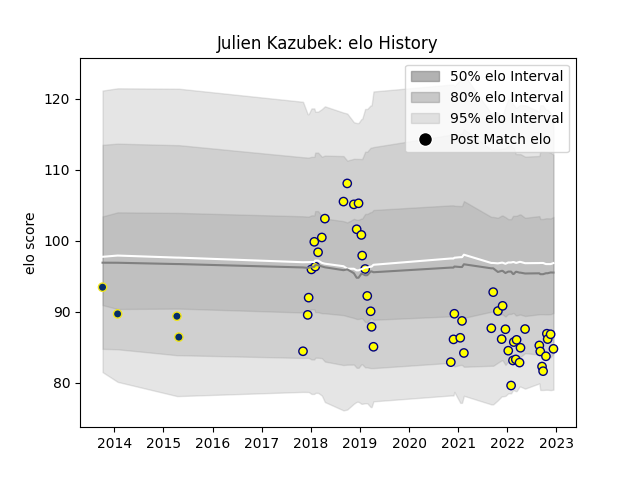

---  
layout: page  
title: Julien Kazubek  
date: 2022-12-18 16:39:33.541474  
categories: player  
---
# Julien Kazubek

## Positions: FL

## Current elo: 90.0

## Current Percentile: 11.0

# Elo History

# Match History

| Team              |   Appearances |   Win Rate |
|:------------------|--------------:|-----------:|
| Nevers            |            52 |   0.442308 |
| Clermont Auvergne |             4 |   0        |

| Opponent           |   Matches |   Win Rate |
|:-------------------|----------:|-----------:|
| Colomiers          |         5 |   0.4      |
| Provence Rugby     |         5 |   0.6      |
| Vannes             |         4 |   0.25     |
| Bayonne            |         4 |   0.375    |
| Biarritz Olympique |         4 |   0.875    |
| Grenoble           |         4 |   0.125    |
| Aurillac           |         4 |   0.25     |
| Montauban          |         4 |   0.25     |
| Soyaux-Angouleme   |         3 |   0.666667 |
| Beziers            |         3 |   0.5      |
| Carcassonne        |         3 |   0.333333 |
| Mont-de-Marsan     |         3 |   0.333333 |
| Narbonne           |         2 |   1        |
| Oyonnax            |         2 |   0        |
| US Bressane        |         1 |   1        |
| Toulon             |         1 |   0        |
| Agen               |         1 |   1        |
| Castres Olympique  |         1 |   0        |
| Brive              |         1 |   0        |
| Massy              |         1 |   0        |