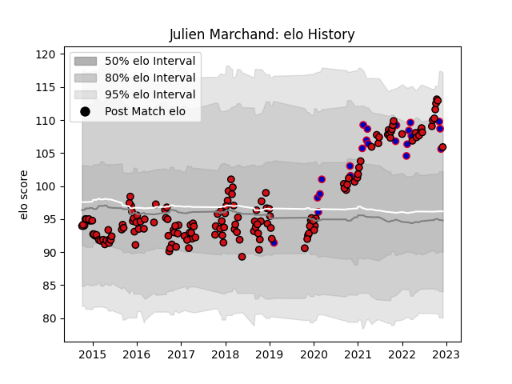

---  
layout: page  
title: Julien Marchand  
date: 2023-01-06 00:09:15.504873  
categories: player  
---
# Julien Marchand

## Positions: H

## Country: France

## Current elo: 123.0

## Current Percentile: 95.0

# Elo History

# Match History

| Team             |   Appearances |   Win Rate |
|:-----------------|--------------:|-----------:|
| Stade Toulousain |           164 |   0.682927 |
| France           |            23 |   0.782609 |

| Opponent             |   Matches |   Win Rate |
|:---------------------|----------:|-----------:|
| Montpellier Herault  |        15 |   0.6      |
| Toulon               |        12 |   0.708333 |
| La Rochelle          |        12 |   0.75     |
| Castres Olympique    |        12 |   0.5      |
| Lyon                 |        11 |   0.590909 |
| Racing 92            |         9 |   0.555556 |
| Clermont Auvergne    |         9 |   0.555556 |
| Bordeaux Begles      |         9 |   0.888889 |
| Brive                |         8 |   0.8125   |
| Stade Francais Paris |         8 |   0.75     |
| Oyonnax              |         7 |   0.714286 |
| Pau                  |         6 |   0.5      |
| Grenoble             |         6 |   0.666667 |
| Wales                |         5 |   0.8      |
| Agen                 |         5 |   1        |
| Bayonne              |         4 |   0.75     |
| Bath Rugby           |         4 |   0.75     |
| Ulster               |         3 |   0.333333 |
| Scotland             |         3 |   0.333333 |
| Sale Sharks          |         3 |   0.833333 |
| Italy                |         3 |   1        |
| Connacht             |         3 |   0.666667 |
| Ireland              |         3 |   1        |
| England              |         3 |   0.666667 |
| Leinster             |         2 |   0.5      |
| Gloucester Rugby     |         2 |   1        |
| Munster              |         2 |   0.5      |
| Glasgow Warriors     |         2 |   1        |
| Wasps                |         2 |   1        |
| Perpignan            |         2 |   1        |
| Biarritz Olympique   |         2 |   1        |
| Japan                |         1 |   1        |
| Australia            |         1 |   1        |
| Cardiff Blues        |         1 |   1        |
| Exeter Chiefs        |         1 |   0        |
| South Africa         |         1 |   1        |
| Saracens             |         1 |   0        |
| Argentina            |         1 |   1        |
| Fiji                 |         1 |   0        |
| Georgia              |         1 |   1        |
| Zebre                |         1 |   1        |