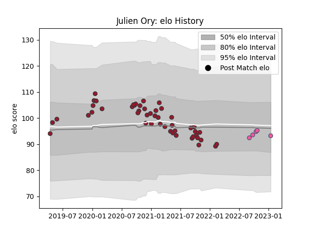

---  
layout: page  
title: Julien Ory  
date: 2023-01-17 11:28:36.329626  
categories: player  
---
# Julien Ory

## Positions: FL

## Current elo: 93.0

## Current Percentile: 48.0

# Elo History

# Match History

| Team                 |   Appearances |   Win Rate |
|:---------------------|--------------:|-----------:|
| Toulon               |            48 |   0.541667 |
| Stade Francais Paris |             5 |   0.8      |

| Opponent             |   Matches |   Win Rate |
|:---------------------|----------:|-----------:|
| Castres Olympique    |         6 |   0.5      |
| Lyon                 |         4 |   0.25     |
| Stade Francais Paris |         4 |   0.75     |
| Bordeaux Begles      |         4 |   0.75     |
| Clermont Auvergne    |         4 |   0.5      |
| Stade Toulousain     |         3 |   0.5      |
| Brive                |         3 |   0.666667 |
| La Rochelle          |         3 |   0        |
| Bayonne              |         3 |   0.333333 |
| Pau                  |         3 |   1        |
| Montpellier Herault  |         3 |   0.5      |
| Scarlets             |         2 |   1        |
| Racing 92            |         2 |   0.5      |
| Agen                 |         2 |   1        |
| London Irish         |         1 |   1        |
| Lions                |         1 |   1        |
| Perpignan            |         1 |   0        |
| Grenoble             |         1 |   0        |
| Bristol Rugby        |         1 |   0        |
| Biarritz Olympique   |         1 |   1        |
| Leicester Tigers     |         1 |   1        |