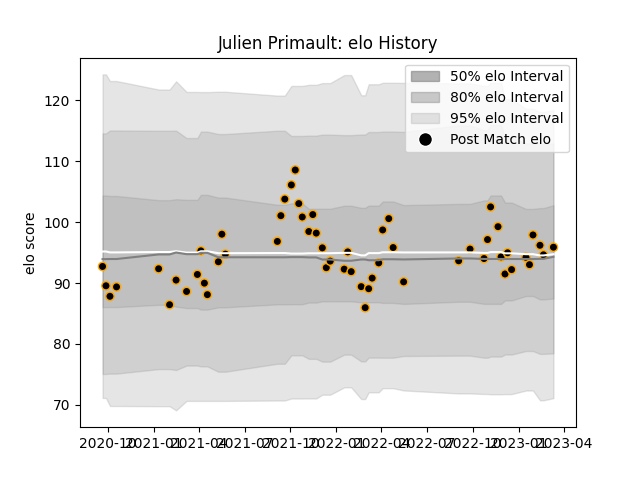

---  
layout: page  
title: Julien Primault  
date: 2022-12-09 13:09:55.027436  
categories: player  
---
# Julien Primault

## Positions: H

## Current elo: 92.0

## Current Percentile: 45.0

# Elo History

# Match History

| Team     |   Appearances |   Win Rate |
|:---------|--------------:|-----------:|
| Chambery |            29 |   0.482759 |

| Opponent                   |   Matches |   Win Rate |
|:---------------------------|----------:|-----------:|
| Nice                       |         4 |   0.5      |
| Albi                       |         3 |   0        |
| Bourgoin-Jallieu           |         3 |   0        |
| Suresnes                   |         3 |   0.666667 |
| Tarbes                     |         3 |   0.666667 |
| Aubenas                    |         2 |   1        |
| Blagnac                    |         2 |   0.5      |
| Massy                      |         2 |   0.5      |
| Narbonne                   |         2 |   1        |
| Carqueiranne-Hyères        |         1 |   0        |
| Cognac Saint Jean d'Angély |         1 |   1        |
| Dax                        |         1 |   0        |
| Dijon                      |         1 |   1        |
| Valence Romans Drome Rugby |         1 |   0        |