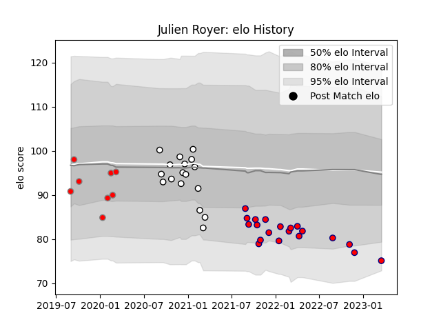

---  
layout: page  
title: Julien Royer  
date: 2023-03-21 18:32:49.782141  
categories: player  
---
# Julien Royer

Last updated: 2023-03-21
## Positions: P

## Current elo: 75.0

## Current Percentile: 8.0

# Elo History

# Match History

| Team                       |   Appearances |   Win Rate |
|:---------------------------|--------------:|-----------:|
| Aurillac                   |            20 |   0.35     |
| Valence Romans Drome Rugby |            17 |   0.294118 |
| Roval Drome XV             |             8 |   0        |

| Opponent           |   Matches |   Win Rate |
|:-------------------|----------:|-----------:|
| Beziers            |         6 |   0.25     |
| Colomiers          |         5 |   0.2      |
| Mont-de-Marsan     |         4 |   0        |
| Montauban          |         3 |   0.666667 |
| Soyaux-Angouleme   |         3 |   0.166667 |
| Rouen              |         3 |   0.333333 |
| Provence Rugby     |         3 |   0.333333 |
| Oyonnax            |         3 |   0        |
| Nevers             |         2 |   0.5      |
| Agen               |         2 |   0.5      |
| Grenoble           |         2 |   0        |
| Carcassonne        |         2 |   1        |
| Biarritz Olympique |         2 |   0        |
| Bayonne            |         2 |   0        |
| Aurillac           |         1 |   0        |
| Perpignan          |         1 |   0        |
| US Bressane        |         1 |   1        |