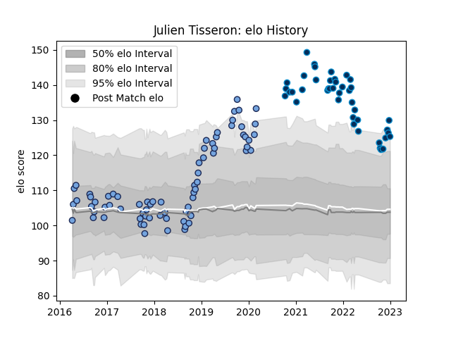

---  
layout: page  
title: Julien Tisseron  
date: 2022-11-15 23:40:59.566164  
categories: player  
---
# Julien Tisseron

## Positions: FB, W

## Current elo: 113.0

## Current Percentile: 90.0

# Elo History

# Match History

| Team                |   Appearances |   Win Rate |
|:--------------------|--------------:|-----------:|
| Bayonne             |            66 |   0.439394 |
| Montpellier Herault |            37 |   0.567568 |

| Opponent             |   Matches |   Win Rate |
|:---------------------|----------:|-----------:|
| Toulon               |         7 |   0.5      |
| Lyon                 |         6 |   0.25     |
| Brive                |         6 |   0.666667 |
| Biarritz Olympique   |         5 |   0.4      |
| Castres Olympique    |         5 |   0.5      |
| Clermont Auvergne    |         5 |   0.4      |
| Stade Toulousain     |         4 |   0.5      |
| Pau                  |         4 |   0        |
| La Rochelle          |         4 |   0.5      |
| Agen                 |         3 |   1        |
| Stade Francais Paris |         3 |   1        |
| Soyaux-Angouleme     |         3 |   0.666667 |
| Perpignan            |         3 |   0.666667 |
| Nevers               |         3 |   0.666667 |
| Montpellier Herault  |         3 |   0        |
| Aurillac             |         3 |   1        |
| Mont-de-Marsan       |         3 |   0.5      |
| Bordeaux Begles      |         3 |   0        |
| Carcassonne          |         3 |   0.666667 |
| Massy                |         2 |   1        |
| Colomiers            |         2 |   1        |
| Bayonne              |         2 |   0.5      |
| Benetton Treviso     |         2 |   0        |
| Scarlets             |         2 |   0        |
| Vannes               |         2 |   0.5      |
| Oyonnax              |         2 |   0.5      |
| Narbonne             |         2 |   0.5      |
| Grenoble             |         2 |   0        |
| Montauban            |         2 |   0.5      |
| London Irish         |         1 |   0        |
| Racing 92            |         1 |   0        |
| Gloucester Rugby     |         1 |   0        |
| Beziers              |         1 |   0        |
| Tarbes               |         1 |   1        |
| US Bressane          |         1 |   1        |
| Provence Rugby       |         1 |   1        |