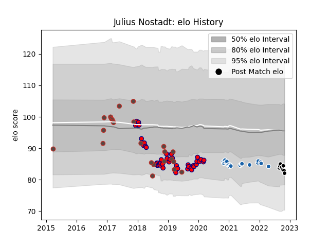

---  
layout: page  
title: Julius Nostadt  
date: 2023-02-02 19:02:04.576266  
categories: player  
---
# Julius Nostadt

## Positions: P

## Country: Germany

## Current elo: 89.0

## Current Percentile: 28.0

# Elo History

# Match History

| Team              |   Appearances |   Win Rate |
|:------------------|--------------:|-----------:|
| Aurillac          |            45 |   0.4      |
| Castres Olympique |            20 |   0.425    |
| Germany           |            17 |   0.411765 |
| Provence Rugby    |             9 |   0.277778 |

| Opponent                 |   Matches |   Win Rate |
|:-------------------------|----------:|-----------:|
| Vannes                   |         4 |   0.25     |
| Carcassonne              |         4 |   0.5      |
| Nevers                   |         4 |   0        |
| Beziers                  |         4 |   0.25     |
| Biarritz Olympique       |         4 |   0.25     |
| Brive                    |         4 |   0.5      |
| Oyonnax                  |         3 |   0.833333 |
| Grenoble                 |         3 |   0.333333 |
| Provence Rugby           |         3 |   0.333333 |
| Montauban                |         3 |   0.666667 |
| Soyaux-Angouleme         |         3 |   0.666667 |
| Brazil                   |         3 |   1        |
| Mont-de-Marsan           |         2 |   0.5      |
| Romania                  |         2 |   0        |
| Perpignan                |         2 |   0        |
| Pau                      |         2 |   1        |
| Toulon                   |         2 |   0.5      |
| US Bressane              |         2 |   0.5      |
| Munster                  |         2 |   0        |
| Samoa                    |         2 |   0        |
| Agen                     |         2 |   0.5      |
| Massy                    |         2 |   0.5      |
| Kenya                    |         2 |   1        |
| Bayonne                  |         2 |   0        |
| Harlequins               |         2 |   0        |
| Bordeaux Begles          |         2 |   0        |
| Colomiers                |         2 |   0.5      |
| Clermont Auvergne        |         2 |   0        |
| Russia                   |         1 |   0        |
| Uruguay                  |         1 |   1        |
| United States of America |         1 |   0        |
| Stade Toulousain         |         1 |   0.5      |
| Spain                    |         1 |   0        |
| Canada                   |         1 |   0        |
| Rouen                    |         1 |   1        |
| Roval Drome XV           |         1 |   0        |
| Aurillac                 |         1 |   0        |
| Racing 92                |         1 |   1        |
| Dax                      |         1 |   1        |
| Portugal                 |         1 |   0        |
| Georgia                  |         1 |   0        |
| Hong Kong                |         1 |   1        |
| Ospreys                  |         1 |   0        |
| Lyon                     |         1 |   1        |
| Montpellier Herault      |         1 |   1        |