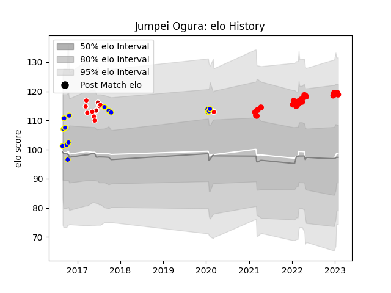

---  
layout: page  
title: Jumpei Ogura  
date: 2023-02-02 19:05:11.759764  
categories: player  
---
# Jumpei Ogura

## Positions: FH, FB

## Country: Japan

## Current elo: 119.0

## Current Percentile: 87.0

# Elo History

# Match History

| Team                  |   Appearances |   Win Rate |
|:----------------------|--------------:|-----------:|
| Yokohama Canon Eagles |            25 |  0.54      |
| Urayasu D-Rocks       |            15 |  0.533333  |
| Sunwolves             |            11 |  0.0909091 |
| Japan                 |             2 |  0.5       |

| Opponent                          |   Matches |   Win Rate |
|:----------------------------------|----------:|-----------:|
| Saitama Wild Knights              |         5 |      0     |
| Kobelco Kobe Steelers             |         5 |      0.4   |
| Black Rams Tokyo                  |         4 |      0.75  |
| Green Rockets Tokatsu             |         4 |      1     |
| Shizuoka Blue Revs                |         4 |      0.5   |
| Kubota Spears Funabashi Tokyo-Bay |         4 |      0.375 |
| Tokyo Sungoliath                  |         3 |      0     |
| Toyota Verblitz                   |         2 |      1     |
| Cheetahs                          |         2 |      0     |
| Stormers                          |         2 |      0     |
| NTT Docomo Red Hurricanes Osaka   |         2 |      0.5   |
| Hanazono Kintetsu Liners          |         2 |      1     |
| Coca-Cola Red Sparks              |         1 |      1     |
| Sharks                            |         1 |      0     |
| Toyota Industries Shuttles Aichi  |         1 |      1     |
| Toshiba Brave Lupus Tokyo         |         1 |      0     |
| Brumbies                          |         1 |      0     |
| Romania                           |         1 |      1     |
| Bulls                             |         1 |      0     |
| Lions                             |         1 |      0     |
| Blues                             |         1 |      1     |
| Jaguares                          |         1 |      0     |
| Ireland                           |         1 |      0     |
| Hurricanes                        |         1 |      0     |
| Hino Red Dolphins                 |         1 |      1     |
| Urayasu D-Rocks                   |         1 |      1     |