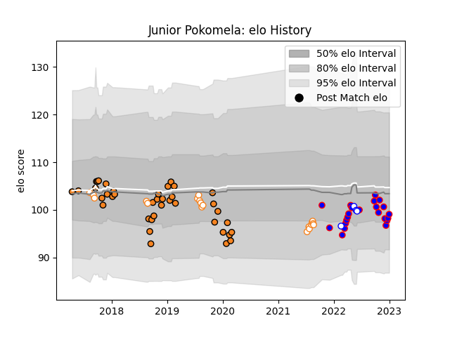

---  
layout: page  
title: Junior Pokomela  
date: 2022-12-14 11:24:07.835256  
categories: player  
---
# Junior Pokomela

## Positions: FL

## Current elo: 95.0

## Current Percentile: 53.0

# Elo History

# Match History

| Team                |   Appearances |   Win Rate |
|:--------------------|--------------:|-----------:|
| Cheetahs            |            39 |   0.474359 |
| Stormers            |            19 |   0.789474 |
| Free State Cheetahs |            14 |   0.464286 |
| Western Province    |             4 |   0.25     |

| Opponent          |   Matches |   Win Rate |
|:------------------|----------:|-----------:|
| Zebre             |         7 |   0.857143 |
| Southern Kings    |         6 |   1        |
| Connacht          |         6 |   0.166667 |
| Cardiff Blues     |         5 |   0.4      |
| Griquas           |         4 |   0.5      |
| Western Province  |         4 |   0.5      |
| Scarlets          |         4 |   0.5      |
| Ospreys           |         4 |   0.75     |
| Ulster            |         3 |   0.5      |
| Pumas             |         3 |   0.666667 |
| Leinster          |         3 |   0.666667 |
| Golden Lions      |         3 |   0.166667 |
| Glasgow Warriors  |         3 |   0.333333 |
| Edinburgh         |         3 |   0.666667 |
| Dragons           |         3 |   0.666667 |
| Blue Bulls        |         2 |   0.5      |
| Lions             |         2 |   0.5      |
| Munster           |         2 |   0        |
| Natal Sharks      |         2 |   0        |
| Bulls             |         2 |   1        |
| Benetton Treviso  |         2 |   0.5      |
| Clermont Auvergne |         1 |   0        |
| Sunwolves         |         1 |   1        |
| Chiefs            |         1 |   0        |