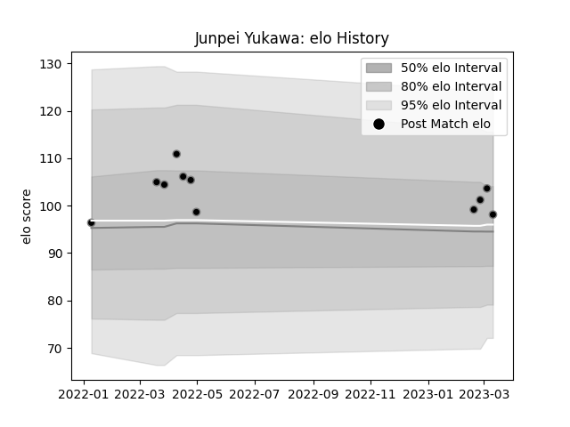

---  
layout: page  
title: Junpei Yukawa  
date: 2023-03-17 17:33:19.325885  
categories: player  
---
# Junpei Yukawa

## Positions: FL

## Current elo: 98.0

## Current Percentile: 61.0

# Elo History

# Match History

| Team             |   Appearances |   Win Rate |
|:-----------------|--------------:|-----------:|
| Black Rams Tokyo |            11 |   0.363636 |

| Opponent                        |   Matches |   Win Rate |
|:--------------------------------|----------:|-----------:|
| Tokyo Sungoliath                |         2 |          0 |
| Green Rockets Tokatsu           |         1 |          1 |
| Hanazono Kintetsu Liners        |         1 |          1 |
| Kobelco Kobe Steelers           |         1 |          1 |
| NTT Docomo Red Hurricanes Osaka |         1 |          1 |
| Saitama Wild Knights            |         1 |          0 |
| Shizuoka Blue Revs              |         1 |          0 |
| Toshiba Brave Lupus Tokyo       |         1 |          0 |
| Toyota Verblitz                 |         1 |          0 |
| Urayasu D-Rocks                 |         1 |          0 |