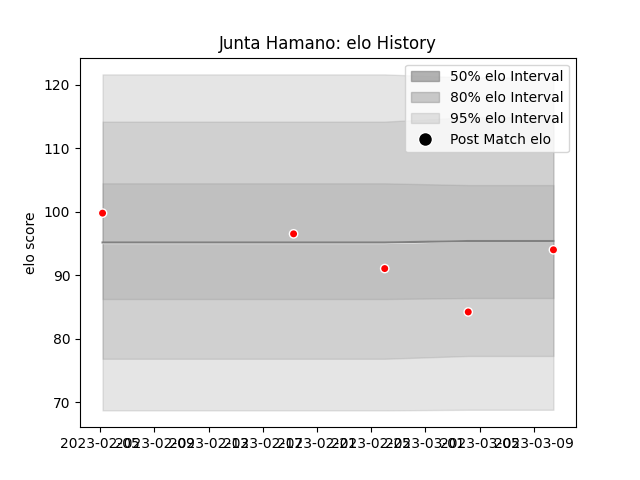

---  
layout: page  
title: Junta Hamano  
date: 2023-03-17 17:21:16.518580  
categories: player  
---
# Junta Hamano

## Positions: C

## Current elo: 94.0

## Current Percentile: 19.0

# Elo History

# Match History

| Team                  |   Appearances |   Win Rate |
|:----------------------|--------------:|-----------:|
| Kobelco Kobe Steelers |             5 |        0.4 |

| Opponent                  |   Matches |   Win Rate |
|:--------------------------|----------:|-----------:|
| Black Rams Tokyo          |         1 |          0 |
| Mitsubishi Dynaboars      |         1 |          1 |
| Saitama Wild Knights      |         1 |          0 |
| Shizuoka Blue Revs        |         1 |          1 |
| Toshiba Brave Lupus Tokyo |         1 |          0 |