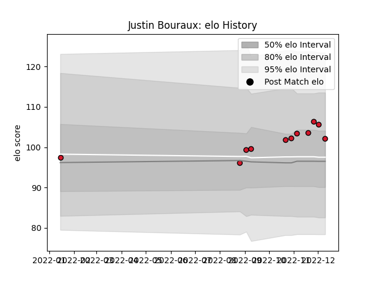

---  
layout: page  
title: Justin Bouraux  
date: 2023-02-02 19:08:14.811948  
categories: player  
---
# Justin Bouraux

## Positions: FH, FB

## Current elo: 100.0

## Current Percentile: 62.0

# Elo History

# Match History

| Team    |   Appearances |   Win Rate |
|:--------|--------------:|-----------:|
| Oyonnax |            17 |   0.823529 |

| Opponent           |   Matches |   Win Rate |
|:-------------------|----------:|-----------:|
| Aurillac           |         2 |        0.5 |
| Beziers            |         2 |        1   |
| Carcassonne        |         2 |        1   |
| Nevers             |         2 |        1   |
| Agen               |         1 |        1   |
| Biarritz Olympique |         1 |        0   |
| Colomiers          |         1 |        1   |
| Grenoble           |         1 |        1   |
| Massy              |         1 |        1   |
| Mont-de-Marsan     |         1 |        0   |
| Montauban          |         1 |        1   |
| Rouen              |         1 |        1   |
| Soyaux-Angouleme   |         1 |        1   |