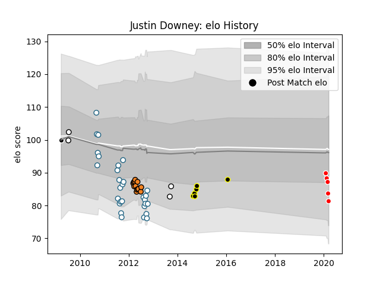

---  
layout: page  
title: Justin Downey  
date: 2023-03-02 11:23:43.448053  
categories: player  
---
# Justin Downey

## Positions: FL

## Current elo: 81.0

## Current Percentile: 20.0

# Elo History

# Match History

| Team             |   Appearances |   Win Rate |
|:-----------------|--------------:|-----------:|
| Griquas          |            29 |   0.396552 |
| Cheetahs         |            13 |   0.384615 |
| Tokyo Sungoliath |             6 |   0.833333 |
| Sunwolves        |             5 |   0.2      |
| Natal Sharks     |             4 |   0.5      |
| Sharks           |             1 |   1        |

| Opponent                         |   Matches |   Win Rate |
|:---------------------------------|----------:|-----------:|
| Western Province                 |         7 |  0.0714286 |
| Golden Lions                     |         6 |  0.5       |
| Blue Bulls                       |         5 |  0.4       |
| Free State Cheetahs              |         5 |  0.2       |
| Natal Sharks                     |         3 |  0.333333  |
| Pumas                            |         3 |  0.666667  |
| Leopards                         |         3 |  1         |
| Chiefs                           |         2 |  0         |
| Stormers                         |         2 |  0         |
| Crusaders                        |         2 |  0         |
| Brumbies                         |         2 |  0         |
| Hurricanes                       |         2 |  0.5       |
| Western Force                    |         2 |  1         |
| Melbourne Rebels                 |         2 |  1         |
| Toyota Industries Shuttles Aichi |         1 |  1         |
| Sharks                           |         1 |  0         |
| New South Wales Waratahs         |         1 |  1         |
| Black Rams Tokyo                 |         1 |  1         |
| NTT Docomo Red Hurricanes Osaka  |         1 |  1         |
| Lions                            |         1 |  1         |
| Highlanders                      |         1 |  0         |
| Hanazono Kintetsu Liners         |         1 |  1         |
| Coca-Cola Red Sparks             |         1 |  1         |
| Bulls                            |         1 |  0         |
| Boland Cavaliers                 |         1 |  1         |
| Kobelco Kobe Steelers            |         1 |  0         |