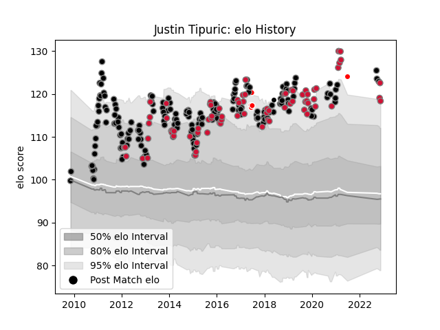

---  
layout: page  
title: Justin Tipuric  
date: 2022-12-14 11:36:35.271766  
categories: player  
---
# Justin Tipuric

## Positions: FL

## Country: Wales

## Current elo: 113.0

## Current Percentile: 93.0

# Elo History

# Match History

| Team                    |   Appearances |   Win Rate |
|:------------------------|--------------:|-----------:|
| Ospreys                 |           188 |   0.590426 |
| Wales                   |            77 |   0.62987  |
| British and Irish Lions |             6 |   0.583333 |
| Barbarians              |             1 |   1        |

| Opponent             |   Matches |   Win Rate |
|:---------------------|----------:|-----------:|
| Cardiff Blues        |        18 |   0.805556 |
| Scarlets             |        17 |   0.529412 |
| Dragons              |        16 |   0.59375  |
| England              |        13 |   0.461538 |
| Leinster             |        13 |   0.461538 |
| Benetton Treviso     |        13 |   0.807692 |
| Ireland              |        13 |   0.5      |
| Munster              |        13 |   0.461538 |
| Connacht             |        12 |   0.916667 |
| France               |        11 |   0.636364 |
| Italy                |         9 |   1        |
| Glasgow Warriors     |         9 |   0.222222 |
| Scotland             |         9 |   0.888889 |
| Edinburgh            |         9 |   0.777778 |
| Zebre                |         8 |   0.875    |
| Ulster               |         8 |   0.375    |
| Northampton Saints   |         6 |   0.166667 |
| Australia            |         5 |   0.4      |
| Clermont Auvergne    |         4 |   0.25     |
| South Africa         |         4 |   0.5      |
| Leicester Tigers     |         4 |   0.375    |
| Argentina            |         3 |   1        |
| New Zealand          |         3 |   0        |
| Saracens             |         3 |   0.166667 |
| Southern Kings       |         2 |   1        |
| Uruguay              |         2 |   1        |
| Worcester Warriors   |         2 |   0.5      |
| Toulon               |         2 |   0.5      |
| Stade Toulousain     |         2 |   0.5      |
| Stade Francais Paris |         2 |   0.5      |
| Newcastle Falcons    |         2 |   0.5      |
| Racing 92            |         2 |   0.25     |
| Aironi               |         2 |   1        |
| Lyon                 |         2 |   1        |
| Georgia              |         2 |   0.5      |
| Biarritz Olympique   |         2 |   0.5      |
| Bordeaux Begles      |         2 |   0.5      |
| Castres Olympique    |         2 |   0.5      |
| Cheetahs             |         2 |   1        |
| London Irish         |         2 |   0.5      |
| Fiji                 |         2 |   1        |
| Exeter Chiefs        |         2 |   0.5      |
| Grenoble             |         1 |   1        |
| Samoa                |         1 |   0        |
| Highlanders          |         1 |   0        |
| Chiefs               |         1 |   1        |
| Provincial Union XV  |         1 |   1        |
| Pau                  |         1 |   1        |
| Tonga                |         1 |   1        |
| Hurricanes           |         1 |   0.5      |
| Blues                |         1 |   0        |
| Lions                |         1 |   0        |
| Wasps                |         1 |   1        |
| Bath Rugby           |         1 |   0        |
| Japan                |         1 |   1        |