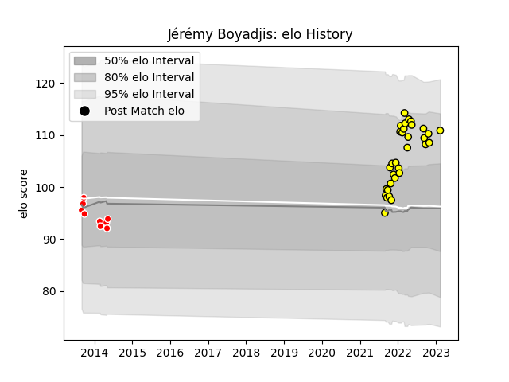

---  
layout: page  
title: Jérémy Boyadjis  
date: 2023-02-15 22:13:09.741913  
categories: player  
---
# Jérémy Boyadjis

## Positions: P

## Current elo: 111.0

## Current Percentile: 82.0

# Elo History

# Match History

| Team        |   Appearances |   Win Rate |
|:------------|--------------:|-----------:|
| Carcassonne |            32 |   0.609375 |
| Auch        |             9 |   0.222222 |

| Opponent           |   Matches |   Win Rate |
|:-------------------|----------:|-----------:|
| Aurillac           |         5 |   0.4      |
| Agen               |         3 |   0.333333 |
| Oyonnax            |         3 |   0        |
| Narbonne           |         3 |   1        |
| Montauban          |         3 |   0.666667 |
| Mont-de-Marsan     |         3 |   0        |
| Beziers            |         3 |   1        |
| Colomiers          |         2 |   1        |
| Rouen              |         2 |   1        |
| US Bressane        |         2 |   1        |
| Vannes             |         2 |   0.75     |
| Dax                |         1 |   0        |
| Grenoble           |         1 |   1        |
| La Rochelle        |         1 |   0        |
| Carcassonne        |         1 |   0        |
| Biarritz Olympique |         1 |   0        |
| Nevers             |         1 |   0        |
| Bayonne            |         1 |   1        |
| Pau                |         1 |   0        |
| Provence Rugby     |         1 |   0        |
| Tarbes             |         1 |   1        |