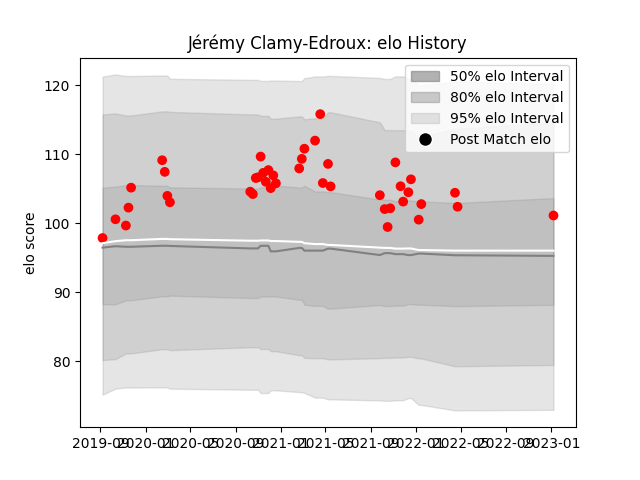

---  
layout: page  
title: Jérémy Clamy-Edroux  
date: 2023-01-13 11:24:35.857788  
categories: player  
---
# Jérémy Clamy-Edroux

## Positions: P

## Current elo: 101.0

## Current Percentile: 73.0

# Elo History

# Match History

| Team   |   Appearances |   Win Rate |
|:-------|--------------:|-----------:|
| Rouen  |            42 |   0.345238 |

| Opponent                   |   Matches |   Win Rate |
|:---------------------------|----------:|-----------:|
| Oyonnax                    |         5 |   0.6      |
| Nevers                     |         4 |   0.25     |
| Beziers                    |         4 |   0.5      |
| Provence Rugby             |         4 |   0.625    |
| Vannes                     |         3 |   0.333333 |
| Soyaux-Angouleme           |         3 |   0.333333 |
| Mont-de-Marsan             |         3 |   0        |
| Perpignan                  |         2 |   0.5      |
| Agen                       |         2 |   0.5      |
| Grenoble                   |         2 |   0        |
| Colomiers                  |         2 |   0        |
| Biarritz Olympique         |         2 |   0        |
| Montauban                  |         2 |   0.5      |
| Aurillac                   |         1 |   0        |
| Bayonne                    |         1 |   0        |
| US Bressane                |         1 |   0        |
| Valence Romans Drome Rugby |         1 |   1        |