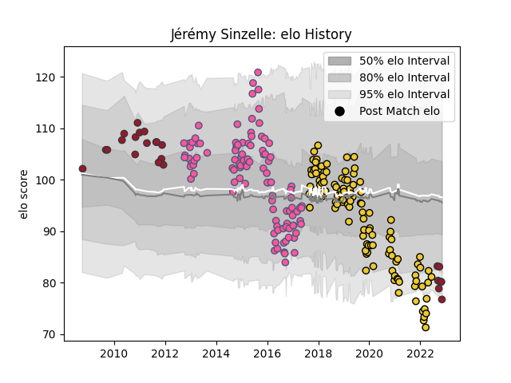

---  
layout: page  
title: Jérémy Sinzelle  
date: 2022-11-15 23:37:04.847023  
categories: player  
---
# Jérémy Sinzelle

## Positions: W, C

## Current elo: 77.0

## Current Percentile: 7.0

# Elo History

# Match History

| Team                 |   Appearances |   Win Rate |
|:---------------------|--------------:|-----------:|
| La Rochelle          |           111 |   0.585586 |
| Stade Francais Paris |           105 |   0.514286 |
| Toulon               |            25 |   0.48     |

| Opponent             |   Matches |   Win Rate |
|:---------------------|----------:|-----------:|
| Stade Toulousain     |        18 |   0.222222 |
| Montpellier Herault  |        17 |   0.411765 |
| Clermont Auvergne    |        17 |   0.441176 |
| Racing 92            |        16 |   0.625    |
| Castres Olympique    |        15 |   0.466667 |
| Bordeaux Begles      |        15 |   0.6      |
| Toulon               |        14 |   0.428571 |
| Brive                |        13 |   0.769231 |
| Pau                  |        12 |   0.833333 |
| Grenoble             |        11 |   0.545455 |
| Bayonne              |         8 |   0.625    |
| Stade Francais Paris |         8 |   0.5      |
| Perpignan            |         7 |   0.571429 |
| Lyon                 |         7 |   0.714286 |
| La Rochelle          |         6 |   0.583333 |
| Agen                 |         6 |   0.666667 |
| Biarritz Olympique   |         5 |   0.6      |
| Oyonnax              |         5 |   0.4      |
| Harlequins           |         4 |   0.75     |
| Leicester Tigers     |         3 |   0.333333 |
| Bristol Rugby        |         3 |   0.666667 |
| Newcastle Falcons    |         3 |   0.333333 |
| Edinburgh            |         2 |   0.5      |
| Bucuresti            |         2 |   1        |
| Sale Sharks          |         2 |   0.5      |
| Mont-de-Marsan       |         2 |   1        |
| Cavalieri Prato      |         2 |   1        |
| Ulster               |         2 |   0.5      |
| Timisoara Saracens   |         1 |   1        |
| Wasps                |         1 |   1        |
| Scarlets             |         1 |   0        |
| Petrarca Padova      |         1 |   1        |
| Leinster             |         1 |   0        |
| Munster              |         1 |   0        |
| Montauban            |         1 |   0        |
| London Welsh         |         1 |   1        |
| Bath Rugby           |         1 |   1        |
| Gloucester Rugby     |         1 |   1        |
| Glasgow Warriors     |         1 |   0        |
| Exeter Chiefs        |         1 |   0        |
| Dragons              |         1 |   0        |
| Cardiff Blues        |         1 |   0        |
| Bourgoin-Jallieu     |         1 |   1        |
| Zebre                |         1 |   1        |