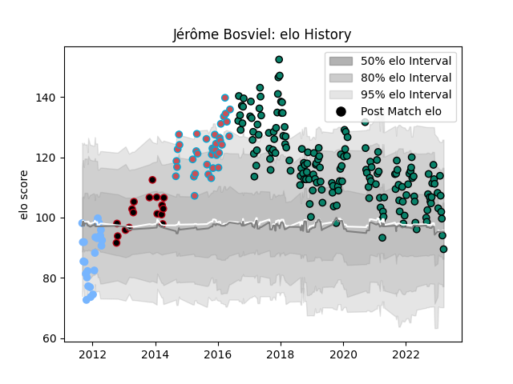

---  
layout: page  
title: Jérôme Bosviel  
date: 2023-03-21 18:49:23.291168  
categories: player  
---
# Jérôme Bosviel

Last updated: 2023-03-21
## Positions: FB, FH

## Current elo: 90.0

## Current Percentile: 44.0

# Elo History

# Match History

| Team             |   Appearances |   Win Rate |
|:-----------------|--------------:|-----------:|
| Montauban        |           164 |   0.530488 |
| Bourgoin-Jallieu |            37 |   0.432432 |
| Périgueux        |            25 |   0.2      |
| Lyon             |            17 |   0.617647 |

| Opponent                   |   Matches |   Win Rate |
|:---------------------------|----------:|-----------:|
| Mont-de-Marsan             |        17 |   0.470588 |
| Aurillac                   |        16 |   0.5625   |
| Beziers                    |        16 |   0.375    |
| Carcassonne                |        16 |   0.375    |
| Biarritz Olympique         |        14 |   0.428571 |
| Provence Rugby             |        13 |   0.461538 |
| Colomiers                  |        13 |   0.615385 |
| Oyonnax                    |        13 |   0.346154 |
| Soyaux-Angouleme           |        11 |   0.590909 |
| Grenoble                   |        11 |   0.272727 |
| Narbonne                   |        11 |   0.681818 |
| Vannes                     |        10 |   0.55     |
| Dax                        |         9 |   0.666667 |
| Nevers                     |         9 |   0.666667 |
| Bayonne                    |         7 |   0.142857 |
| Perpignan                  |         6 |   0.166667 |
| Massy                      |         6 |   0.833333 |
| Albi                       |         6 |   0.666667 |
| Bourgoin-Jallieu           |         5 |   0.2      |
| Agen                       |         5 |   0.6      |
| Pau                        |         4 |   0        |
| Rouen                      |         4 |   0.75     |
| Auch                       |         4 |   0.5      |
| US Bressane                |         4 |   0.75     |
| Brive                      |         3 |   0.5      |
| Lyon                       |         2 |   0        |
| La Rochelle                |         2 |   0.5      |
| Roval Drome XV             |         2 |   1        |
| Tarbes                     |         2 |   1        |
| Montauban                  |         1 |   0        |
| Valence Romans Drome Rugby |         1 |   1        |