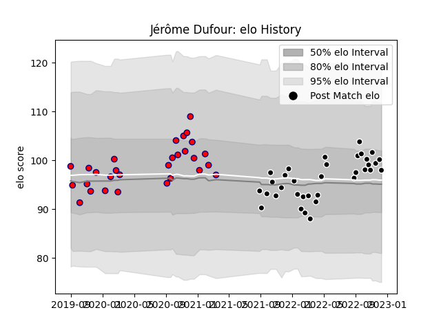

---  
layout: page  
title: Jérôme Dufour  
date: 2022-12-09 13:06:37.323851  
categories: player  
---
# Jérôme Dufour

## Positions: L

## Current elo: 100.0

## Current Percentile: 66.0

# Elo History

# Match History

| Team           |   Appearances |   Win Rate |
|:---------------|--------------:|-----------:|
| Provence Rugby |            33 |   0.621212 |
| Aurillac       |            29 |   0.413793 |

| Opponent                   |   Matches |   Win Rate |
|:---------------------------|----------:|-----------:|
| Vannes                     |         6 |   0.333333 |
| Carcassonne                |         6 |   0.833333 |
| Mont-de-Marsan             |         6 |   0.5      |
| Beziers                    |         5 |   0.4      |
| Rouen                      |         4 |   0.5      |
| Colomiers                  |         4 |   0.25     |
| Grenoble                   |         4 |   0.75     |
| Nevers                     |         3 |   0.666667 |
| Provence Rugby             |         3 |   0.333333 |
| Oyonnax                    |         3 |   0.833333 |
| Agen                       |         3 |   0.333333 |
| Aurillac                   |         3 |   0.333333 |
| Montauban                  |         3 |   1        |
| Soyaux-Angouleme           |         2 |   0.5      |
| Narbonne                   |         1 |   0        |
| Massy                      |         1 |   0        |
| Biarritz Olympique         |         1 |   0        |
| Bayonne                    |         1 |   1        |
| Roval Drome XV             |         1 |   0        |
| US Bressane                |         1 |   1        |
| Valence Romans Drome Rugby |         1 |   1        |