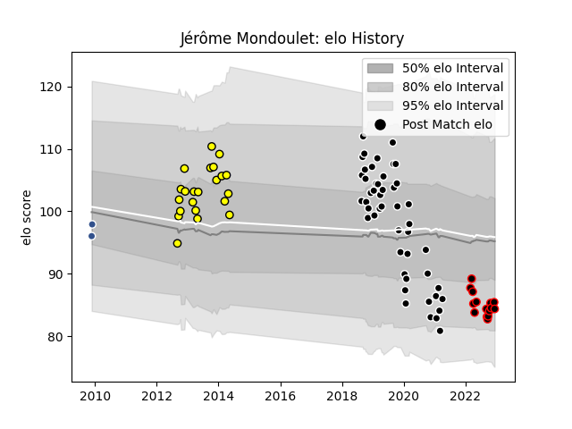

---  
layout: page  
title: Jérôme Mondoulet  
date: 2022-12-18 16:22:35.910112  
categories: player  
---
# Jérôme Mondoulet

## Positions: L

## Current elo: 84.0

## Current Percentile: 16.0

# Elo History

# Match History

| Team           |   Appearances |   Win Rate |
|:---------------|--------------:|-----------:|
| Provence Rugby |            48 |   0.447917 |
| Albi           |            22 |   0.318182 |
| Nice           |            15 |   0.633333 |
| Agen           |             2 |   1        |

| Opponent                   |   Matches |   Win Rate |
|:---------------------------|----------:|-----------:|
| Colomiers                  |         8 |   0.5      |
| Aurillac                   |         6 |   0.5      |
| Tarbes                     |         5 |   0.6      |
| Nevers                     |         5 |   0.4      |
| Oyonnax                    |         5 |   0.2      |
| Vannes                     |         4 |   0.5      |
| Dax                        |         4 |   0.25     |
| Biarritz Olympique         |         4 |   0.25     |
| Mont-de-Marsan             |         4 |   0.25     |
| Carcassonne                |         3 |   0.333333 |
| Montauban                  |         3 |   0.666667 |
| Beziers                    |         3 |   0.333333 |
| US Bressane                |         3 |   0.333333 |
| Provence Rugby             |         2 |   1        |
| Suresnes                   |         2 |   1        |
| Narbonne                   |         2 |   0        |
| Soyaux-Angouleme           |         2 |   0        |
| Massy                      |         2 |   1        |
| Bayonne                    |         2 |   0.5      |
| Brive                      |         2 |   0.5      |
| Albi                       |         1 |   0.5      |
| Rouen                      |         1 |   0.5      |
| Valence Romans Drome Rugby |         1 |   1        |
| Aubenas                    |         1 |   1        |
| Auch                       |         1 |   0        |
| Bourgoin-Jallieu           |         1 |   0        |
| Roval Drome XV             |         1 |   1        |
| Rennes                     |         1 |   1        |
| Lyon                       |         1 |   1        |
| Perpignan                  |         1 |   1        |
| Pau                        |         1 |   0        |
| Carqueiranne-Hyères        |         1 |   1        |
| Cognac Saint Jean d'Angély |         1 |   0        |
| Grenoble                   |         1 |   0        |
| La Rochelle                |         1 |   1        |
| Agen                       |         1 |   0        |