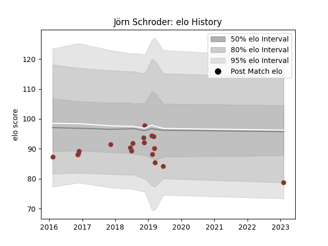

---  
layout: page  
title: Jörn Schroder  
date: 2023-02-05 15:10:15.646513  
categories: player  
---
# Jörn Schroder

## Positions: L, P

## Country: Germany

## Current elo: 79.0

## Current Percentile: None

# Elo History

# Match History

| Team    |   Appearances |   Win Rate |
|:--------|--------------:|-----------:|
| Germany |            18 |   0.388889 |

| Opponent   |   Matches |   Win Rate |
|:-----------|----------:|-----------:|
| Brazil     |         3 |        1   |
| Georgia    |         3 |        0   |
| Portugal   |         2 |        0.5 |
| Samoa      |         2 |        0   |
| Belgium    |         1 |        0   |
| Canada     |         1 |        0   |
| Hong Kong  |         1 |        1   |
| Kenya      |         1 |        1   |
| Romania    |         1 |        0   |
| Russia     |         1 |        0   |
| Spain      |         1 |        0   |
| Uruguay    |         1 |        1   |