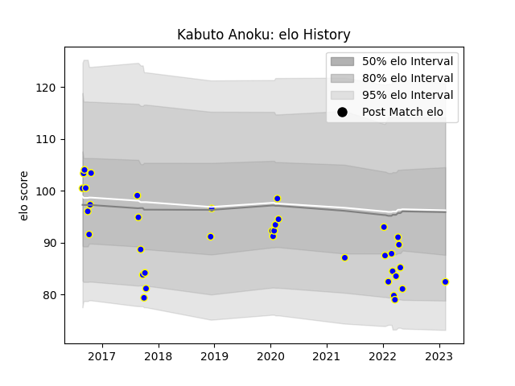

---  
layout: page  
title: Kabuto Anoku  
date: 2023-02-15 22:15:23.292834  
categories: player  
---
# Kabuto Anoku

## Positions: P

## Current elo: 82.0

## Current Percentile: 13.0

# Elo History

# Match History

| Team            |   Appearances |   Win Rate |
|:----------------|--------------:|-----------:|
| Urayasu D-Rocks |            37 |   0.513514 |

| Opponent                          |   Matches |   Win Rate |
|:----------------------------------|----------:|-----------:|
| Saitama Wild Knights              |         5 |   0.2      |
| Black Rams Tokyo                  |         4 |   0.75     |
| Tokyo Sungoliath                  |         3 |   0        |
| Shizuoka Blue Revs                |         3 |   0        |
| Kobelco Kobe Steelers             |         3 |   0.333333 |
| Kubota Spears Funabashi Tokyo-Bay |         3 |   0.333333 |
| Toyota Verblitz                   |         2 |   0.5      |
| Toshiba Brave Lupus Tokyo         |         2 |   1        |
| Yokohama Canon Eagles             |         2 |   0        |
| Green Rockets Tokatsu             |         2 |   1        |
| Coca-Cola Red Sparks              |         1 |   1        |
| NTT Docomo Red Hurricanes Osaka   |         1 |   1        |
| Mie Honda Heat                    |         1 |   1        |
| Kamaishi Seawaves                 |         1 |   1        |
| Hino Red Dolphins                 |         1 |   1        |
| Hanazono Kintetsu Liners          |         1 |   1        |
| Toyota Industries Shuttles Aichi  |         1 |   1        |
| Munakata Sanix Blues              |         1 |   1        |