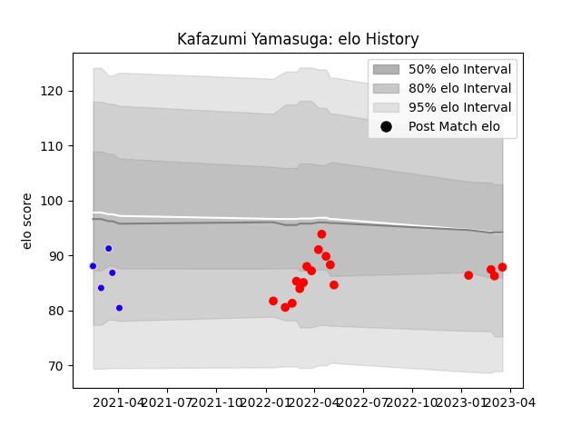

---  
layout: page  
title: Kafazumi Yamasuga  
date: 2023-03-21 18:55:16.532302  
categories: player  
---
# Kafazumi Yamasuga

Last updated: 2023-03-21
## Positions: SH

## Current elo: 88.0

## Current Percentile: 20.0

# Elo History

# Match History

| Team                  |   Appearances |   Win Rate |
|:----------------------|--------------:|-----------:|
| Yokohama Canon Eagles |            17 |   0.617647 |
| Kurita Water Gush     |             5 |   0.4      |

| Opponent                          |   Matches |   Win Rate |
|:----------------------------------|----------:|-----------:|
| Kubota Spears Funabashi Tokyo-Bay |         3 |   0.333333 |
| Hanazono Kintetsu Liners          |         2 |   0.5      |
| Kamaishi Seawaves                 |         2 |   0        |
| Kobelco Kobe Steelers             |         2 |   0.5      |
| Shizuoka Blue Revs                |         2 |   0.75     |
| Toyota Verblitz                   |         2 |   1        |
| Black Rams Tokyo                  |         1 |   1        |
| Green Rockets Tokatsu             |         1 |   1        |
| Kyuden Voltex                     |         1 |   1        |
| NTT Docomo Red Hurricanes Osaka   |         1 |   1        |
| Saitama Wild Knights              |         1 |   0        |
| Shimizu Blue Sharks               |         1 |   1        |
| Tokyo Sungoliath                  |         1 |   0        |
| Toshiba Brave Lupus Tokyo         |         1 |   0        |
| Urayasu D-Rocks                   |         1 |   1        |