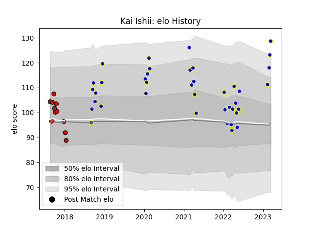

---  
layout: page  
title: Kai Ishii  
date: 2023-03-21 18:07:58.545386  
categories: player  
---
# Kai Ishii

Last updated: 2023-03-21
## Positions: W

## Current elo: 129.0

## Current Percentile: 93.0

# Elo History

# Match History

| Team                      |   Appearances |   Win Rate |
|:--------------------------|--------------:|-----------:|
| Urayasu D-Rocks           |            39 |   0.5      |
| Toshiba Brave Lupus Tokyo |            11 |   0.545455 |

| Opponent                          |   Matches |   Win Rate |
|:----------------------------------|----------:|-----------:|
| Kobelco Kobe Steelers             |         5 |   0.2      |
| Tokyo Sungoliath                  |         5 |   0        |
| Saitama Wild Knights              |         4 |   0.25     |
| Green Rockets Tokatsu             |         4 |   0.75     |
| Kubota Spears Funabashi Tokyo-Bay |         4 |   0.25     |
| Munakata Sanix Blues              |         3 |   1        |
| Toyota Verblitz                   |         3 |   0        |
| Toyota Industries Shuttles Aichi  |         3 |   1        |
| Mitsubishi Dynaboars              |         3 |   0.166667 |
| Toshiba Brave Lupus Tokyo         |         2 |   1        |
| Shizuoka Blue Revs                |         2 |   0        |
| Black Rams Tokyo                  |         2 |   1        |
| Mie Honda Heat                    |         2 |   1        |
| Kamaishi Seawaves                 |         2 |   1        |
| Hino Red Dolphins                 |         2 |   1        |
| Shimizu Blue Sharks               |         1 |   1        |
| NTT Docomo Red Hurricanes Osaka   |         1 |   1        |
| Coca-Cola Red Sparks              |         1 |   1        |
| Yokohama Canon Eagles             |         1 |   0        |