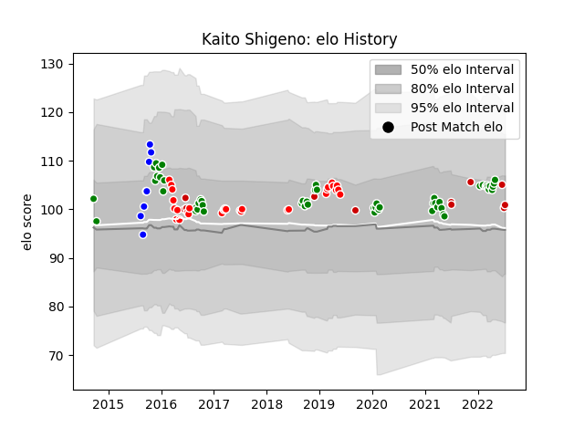

---  
layout: page  
title: Kaito Shigeno  
date: 2022-12-18 16:30:03.230800  
categories: player  
---
# Kaito Shigeno

## Positions: SH

## Country: Japan

## Current elo: 93.0

## Current Percentile: 37.0

# Elo History

# Match History

| Team                  |   Appearances |   Win Rate |
|:----------------------|--------------:|-----------:|
| Sunwolves             |            28 |   0.142857 |
| Green Rockets Tokatsu |            14 |   0.285714 |
| Toyota Verblitz       |            14 |   0.571429 |
| Japan                 |             9 |   0.222222 |
| Auckland              |             8 |   0.5625   |

| Opponent                          |   Matches |   Win Rate |
|:----------------------------------|----------:|-----------:|
| Shizuoka Blue Revs                |         4 |   0.5      |
| Melbourne Rebels                  |         4 |   0        |
| Bulls                             |         3 |   0        |
| Tokyo Sungoliath                  |         3 |   0        |
| Cheetahs                          |         3 |   0        |
| New South Wales Waratahs          |         3 |   0.333333 |
| Black Rams Tokyo                  |         2 |   0.5      |
| Kubota Spears Funabashi Tokyo-Bay |         2 |   0.75     |
| Toyota Industries Shuttles Aichi  |         2 |   0.5      |
| Toshiba Brave Lupus Tokyo         |         2 |   0        |
| Tasman                            |         2 |   1        |
| Stormers                          |         2 |   0        |
| Sharks                            |         2 |   0        |
| Scotland                          |         2 |   0        |
| Saitama Wild Knights              |         2 |   0        |
| NTT Docomo Red Hurricanes Osaka   |         2 |   0.75     |
| Yokohama Canon Eagles             |         2 |   0        |
| Brumbies                          |         2 |   0        |
| Canterbury                        |         2 |   0        |
| France                            |         2 |   0        |
| Jaguares                          |         1 |   1        |
| South Africa                      |         1 |   0        |
| Western Force                     |         1 |   0        |
| Waikato                           |         1 |   1        |
| Urayasu D-Rocks                   |         1 |   0        |
| Toyota Verblitz                   |         1 |   1        |
| British and Irish Lions           |         1 |   0        |
| Chiefs                            |         1 |   1        |
| Coca-Cola Red Sparks              |         1 |   1        |
| Southland                         |         1 |   0.5      |
| Southern Kings                    |         1 |   0        |
| Counties Manukau                  |         1 |   1        |
| Kobelco Kobe Steelers             |         1 |   0        |
| Green Rockets Tokatsu             |         1 |   1        |
| Hawke's Bay                       |         1 |   0        |
| Russia                            |         1 |   1        |
| Queensland Reds                   |         1 |   0        |
| Portugal                          |         1 |   1        |
| Highlanders                       |         1 |   0        |
| Hino Red Dolphins                 |         1 |   1        |
| Blues                             |         1 |   1        |
| Hurricanes                        |         1 |   0        |
| Lions                             |         1 |   0        |
| Ireland                           |         1 |   0        |
| Mie Honda Heat                    |         1 |   1        |