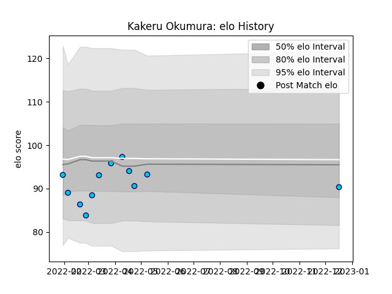

---  
layout: page  
title: Kakeru Okumura  
date: 2023-02-02 19:13:10.606963  
categories: player  
---
# Kakeru Okumura

## Positions: FB, W

## Current elo: 101.0

## Current Percentile: 50.0

# Elo History

# Match History

| Team               |   Appearances |   Win Rate |
|:-------------------|--------------:|-----------:|
| Shizuoka Blue Revs |            14 |   0.357143 |

| Opponent                          |   Matches |   Win Rate |
|:----------------------------------|----------:|-----------:|
| Green Rockets Tokatsu             |         2 |          1 |
| Saitama Wild Knights              |         2 |          0 |
| Toshiba Brave Lupus Tokyo         |         2 |          0 |
| Toyota Verblitz                   |         2 |          0 |
| Black Rams Tokyo                  |         1 |          1 |
| Kubota Spears Funabashi Tokyo-Bay |         1 |          0 |
| NTT Docomo Red Hurricanes Osaka   |         1 |          1 |
| Tokyo Sungoliath                  |         1 |          0 |
| Urayasu D-Rocks                   |         1 |          1 |
| Yokohama Canon Eagles             |         1 |          0 |