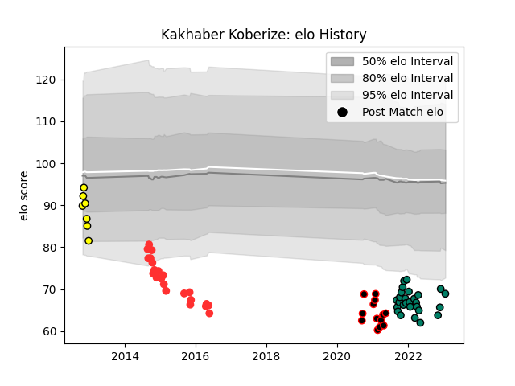

---  
layout: page  
title: Kakhaber Koberize  
date: 2022-12-14 11:37:04.460479  
categories: player  
---
# Kakhaber Koberize

## Positions: P

## Current elo: 81.0

## Current Percentile: 4.0

# Elo History

# Match History

| Team     |   Appearances |   Win Rate |
|:---------|--------------:|-----------:|
| Suresnes |            14 |   0.714286 |
| Albi     |             5 |   0        |
| Tarbes   |             4 |   0        |

| Opponent                   |   Matches |   Win Rate |
|:---------------------------|----------:|-----------:|
| Chambery                   |         2 |        0.5 |
| Bourgoin-Jallieu           |         2 |        0.5 |
| Dijon                      |         2 |        1   |
| Cognac Saint Jean d'Angély |         2 |        1   |
| Tarbes                     |         2 |        1   |
| Beziers                    |         2 |        0   |
| Blagnac                    |         1 |        0   |
| Brive                      |         1 |        0   |
| Carcassonne                |         1 |        0   |
| Aubenas                    |         1 |        1   |
| Colomiers                  |         1 |        0   |
| Aurillac                   |         1 |        0   |
| Lyon                       |         1 |        0   |
| Narbonne                   |         1 |        0   |
| Nice                       |         1 |        1   |
| Soyaux-Angouleme           |         1 |        0   |
| Albi                       |         1 |        0   |