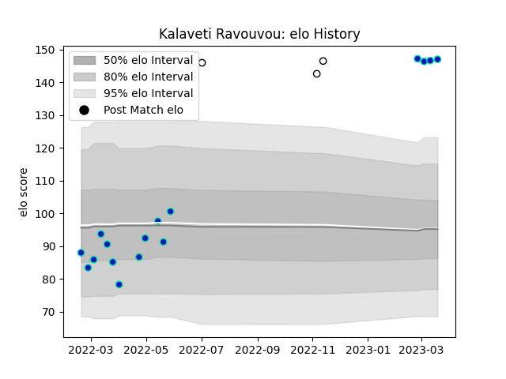

---  
layout: page  
title: Kalaveti Ravouvou  
date: 2023-03-21 18:54:45.951843  
categories: player  
---
# Kalaveti Ravouvou

Last updated: 2023-03-21
## Positions: C

## Country: Fiji

## Current elo: 147.0

## Current Percentile: 99.0

# Elo History

# Match History

| Team        |   Appearances |   Win Rate |
|:------------|--------------:|-----------:|
| Fijian Drua |            16 |   0.25     |
| Fiji        |             3 |   0.333333 |

| Opponent                 |   Matches |   Win Rate |
|:-------------------------|----------:|-----------:|
| New South Wales Waratahs |         3 |        0   |
| Crusaders                |         2 |        0.5 |
| Melbourne Rebels         |         2 |        0.5 |
| Moana Pasifika           |         2 |        1   |
| Queensland Reds          |         2 |        0   |
| Blues                    |         1 |        0   |
| Brumbies                 |         1 |        0   |
| Chiefs                   |         1 |        0   |
| Highlanders              |         1 |        0   |
| Ireland                  |         1 |        0   |
| Scotland                 |         1 |        0   |
| Tonga                    |         1 |        1   |
| Western Force            |         1 |        0   |