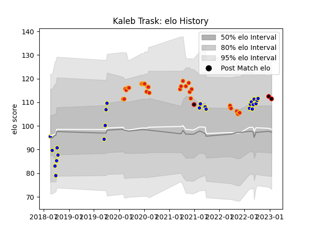

---  
layout: page  
title: Kaleb Trask  
date: 2023-01-17 11:29:06.418935  
categories: player  
---
# Kaleb Trask

## Positions: FH, FB

## Country: New Zealand Maori

## Current elo: 111.0

## Current Percentile: 80.0

# Elo History

# Match History

| Team              |   Appearances |   Win Rate |
|:------------------|--------------:|-----------:|
| Chiefs            |            29 |   0.517241 |
| Bay of Plenty     |            24 |   0.583333 |
| Mie Honda Heat    |             2 |   1        |
| New Zealand Maori |             1 |   1        |

| Opponent                 |   Matches |   Win Rate |
|:-------------------------|----------:|-----------:|
| Blues                    |         5 |   0.4      |
| Taranaki                 |         4 |   0.75     |
| Crusaders                |         4 |   0.25     |
| Hurricanes               |         4 |   0.25     |
| Brumbies                 |         3 |   0.333333 |
| Waikato                  |         3 |   0.333333 |
| Hawke's Bay              |         3 |   0.666667 |
| Highlanders              |         3 |   0.333333 |
| Melbourne Rebels         |         2 |   1        |
| Northland                |         2 |   1        |
| Southland                |         2 |   1        |
| New South Wales Waratahs |         2 |   1        |
| Moana Pasifika           |         2 |   1        |
| Manawatu                 |         2 |   0.5      |
| Otago                    |         2 |   0.5      |
| Sunwolves                |         1 |   1        |
| Samoa                    |         1 |   1        |
| Tasman                   |         1 |   0        |
| Wellington               |         1 |   0        |
| Auckland                 |         1 |   1        |
| Queensland Reds          |         1 |   0        |
| North Harbour            |         1 |   1        |
| Kamaishi Seawaves        |         1 |   1        |
| Hino Red Dolphins        |         1 |   1        |
| Fijian Drua              |         1 |   1        |
| Counties Manukau         |         1 |   0        |
| Canterbury               |         1 |   0        |
| Western Force            |         1 |   1        |