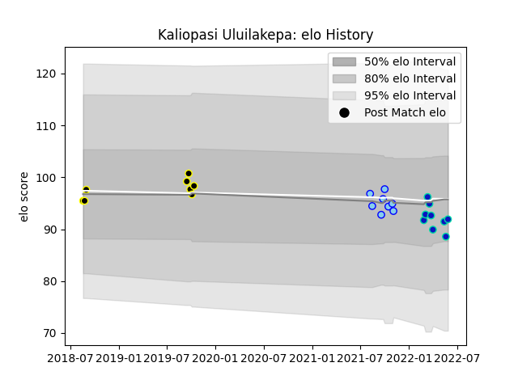

---  
layout: page  
title: Kaliopasi Uluilakepa  
date: 2023-03-04 11:43:43.227645  
categories: player  
---
# Kaliopasi Uluilakepa

## Positions: P

## Current elo: 92.0

## Current Percentile: 27.0

# Elo History

# Match History

| Team        |   Appearances |   Win Rate |
|:------------|--------------:|-----------:|
| Fijian Drua |             9 |   0.222222 |
| Northland   |             8 |   0.125    |
| Wellington  |             8 |   0.75     |

| Opponent                 |   Matches |   Win Rate |
|:-------------------------|----------:|-----------:|
| Otago                    |         3 |   0.666667 |
| Waikato                  |         2 |   1        |
| Southland                |         2 |   0.5      |
| Melbourne Rebels         |         2 |   0.5      |
| Auckland                 |         1 |   1        |
| Northland                |         1 |   1        |
| Wellington               |         1 |   0        |
| Tasman                   |         1 |   0        |
| Taranaki                 |         1 |   0        |
| Queensland Reds          |         1 |   0        |
| North Harbour            |         1 |   0        |
| Bay of Plenty            |         1 |   0        |
| New South Wales Waratahs |         1 |   0        |
| Moana Pasifika           |         1 |   1        |
| Manawatu                 |         1 |   0        |
| Crusaders                |         1 |   0        |
| Chiefs                   |         1 |   0        |
| Canterbury               |         1 |   0        |
| Brumbies                 |         1 |   0        |
| Western Force            |         1 |   0        |