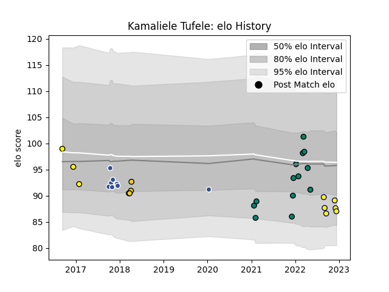

---  
layout: page  
title: Kamaliele Tufele  
date: 2022-12-14 11:36:01.220183  
categories: player  
---
# Kamaliele Tufele

## Positions: P

## Current elo: 87.0

## Current Percentile: 16.0

# Elo History

# Match History

| Team        |   Appearances |   Win Rate |
|:------------|--------------:|-----------:|
| Montauban   |            13 |   0.423077 |
| Agen        |             8 |   0.25     |
| Nevers      |             6 |   0.416667 |
| La Rochelle |             4 |   0.5      |
| Albi        |             3 |   0.666667 |

| Opponent            |   Matches |   Win Rate |
|:--------------------|----------:|-----------:|
| Mont-de-Marsan      |         3 |   0.333333 |
| Carcassonne         |         3 |   0        |
| Narbonne            |         2 |   1        |
| Beziers             |         2 |   0.5      |
| Biarritz Olympique  |         2 |   0.25     |
| Pau                 |         2 |   0        |
| Bayonne             |         2 |   0        |
| Wasps               |         1 |   0        |
| Toulon              |         1 |   1        |
| Stade Toulousain    |         1 |   0        |
| Soyaux-Angouleme    |         1 |   1        |
| Scarlets            |         1 |   0        |
| Rouen               |         1 |   1        |
| Oyonnax             |         1 |   0        |
| Aurillac            |         1 |   1        |
| Montpellier Herault |         1 |   0        |
| Montauban           |         1 |   0        |
| Lyon                |         1 |   1        |
| Grenoble            |         1 |   0.5      |
| Gloucester Rugby    |         1 |   0        |
| Colomiers           |         1 |   1        |
| Castres Olympique   |         1 |   0        |
| Bourgoin-Jallieu    |         1 |   1        |
| Bordeaux Begles     |         1 |   1        |
| Zebre               |         1 |   1        |