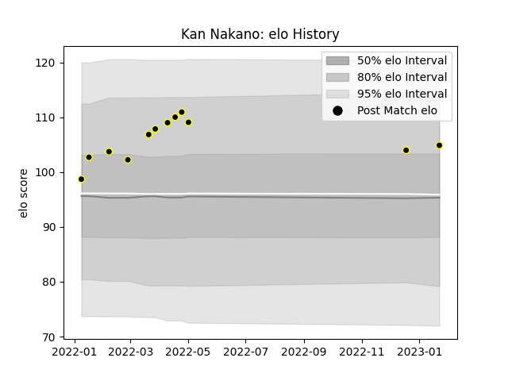

---  
layout: page  
title: Kan Nakano  
date: 2023-01-25 18:57:51.236618  
categories: player  
---
# Kan Nakano

## Positions: P

## Current elo: 105.0

## Current Percentile: 76.0

# Elo History

# Match History

| Team             |   Appearances |   Win Rate |
|:-----------------|--------------:|-----------:|
| Tokyo Sungoliath |            12 |       0.75 |

| Opponent                          |   Matches |   Win Rate |
|:----------------------------------|----------:|-----------:|
| NTT Docomo Red Hurricanes Osaka   |         2 |        1   |
| Toshiba Brave Lupus Tokyo         |         2 |        0.5 |
| Black Rams Tokyo                  |         1 |        1   |
| Hanazono Kintetsu Liners          |         1 |        1   |
| Kubota Spears Funabashi Tokyo-Bay |         1 |        0   |
| Saitama Wild Knights              |         1 |        0   |
| Shizuoka Blue Revs                |         1 |        1   |
| Toyota Verblitz                   |         1 |        1   |
| Urayasu D-Rocks                   |         1 |        1   |
| Yokohama Canon Eagles             |         1 |        1   |