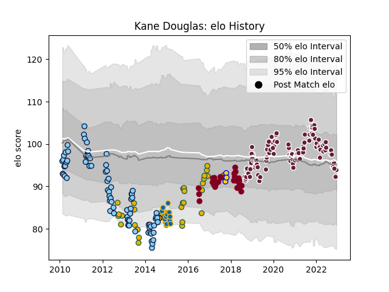

---  
layout: page  
title: Kane Douglas  
date: 2022-12-18 16:35:10.114219  
categories: player  
---
# Kane Douglas

## Positions: L

## Country: Australia

## Current elo: 94.0

## Current Percentile: 36.0

# Elo History

# Match History

| Team                     |   Appearances |   Win Rate |
|:-------------------------|--------------:|-----------:|
| Bordeaux Begles          |           103 |   0.597087 |
| New South Wales Waratahs |            76 |   0.539474 |
| Queensland Reds          |            29 |   0.275862 |
| Australia                |            27 |   0.555556 |
| Leinster                 |            20 |   0.675    |
| Brisbane City            |             6 |   0.666667 |
| NSW Country Eagles       |             1 |   1        |

| Opponent                 |   Matches |   Win Rate |
|:-------------------------|----------:|-----------:|
| Brumbies                 |        14 |   0.5      |
| Melbourne Rebels         |        11 |   0.727273 |
| Clermont Auvergne        |        10 |   0.7      |
| Queensland Reds          |         9 |   0.444444 |
| Western Force            |         9 |   0.666667 |
| Montpellier Herault      |         9 |   0.555556 |
| Racing 92                |         9 |   0.666667 |
| Castres Olympique        |         8 |   0.8125   |
| Lyon                     |         7 |   0.714286 |
| Blues                    |         7 |   0.285714 |
| Perpignan                |         7 |   0.642857 |
| Pau                      |         7 |   0.428571 |
| Toulon                   |         7 |   0.571429 |
| Stade Toulousain         |         7 |   0.285714 |
| Crusaders                |         6 |   0.166667 |
| Stade Francais Paris     |         6 |   0.833333 |
| Chiefs                   |         6 |   0.5      |
| Hurricanes               |         6 |   0.333333 |
| Bulls                    |         6 |   0.333333 |
| Stormers                 |         6 |   0.333333 |
| La Rochelle              |         5 |   0.4      |
| Highlanders              |         5 |   0.2      |
| Argentina                |         5 |   1        |
| Lions                    |         5 |   0.8      |
| Agen                     |         5 |   0.8      |
| Sharks                   |         4 |   0.75     |
| South Africa             |         4 |   0.25     |
| Edinburgh                |         4 |   0.875    |
| Cheetahs                 |         4 |   0.25     |
| New Zealand              |         4 |   0        |
| Brive                    |         4 |   0.5      |
| British and Irish Lions  |         3 |   0.333333 |
| Bayonne                  |         3 |   0.666667 |
| Southern Kings           |         2 |   1        |
| Ospreys                  |         2 |   0.75     |
| New South Wales Waratahs |         2 |   0        |
| Wales                    |         2 |   1        |
| Wasps                    |         2 |   0.75     |
| Munster                  |         2 |   0        |
| Zebre                    |         2 |   1        |
| England                  |         2 |   0.5      |
| Cardiff Blues            |         2 |   1        |
| Harlequins               |         2 |   0.5      |
| Grenoble                 |         2 |   0.5      |
| Greater Sydney Rams      |         2 |   0.5      |
| Biarritz Olympique       |         2 |   0.5      |
| France                   |         2 |   0.5      |
| Jaguares                 |         2 |   0.5      |
| Benetton Treviso         |         1 |   0.5      |
| Bristol Rugby            |         1 |   0        |
| Uruguay                  |         1 |   1        |
| United States of America |         1 |   1        |
| Ulster                   |         1 |   1        |
| Canberra Vikings         |         1 |   1        |
| Sydney Rays              |         1 |   1        |
| Sunwolves                |         1 |   0        |
| Melbourne Rising         |         1 |   1        |
| Connacht                 |         1 |   1        |
| Dragons                  |         1 |   0        |
| Fiji                     |         1 |   1        |
| Fijian Drua              |         1 |   1        |
| Scotland                 |         1 |   1        |
| Scarlets                 |         1 |   0        |
| Sale Sharks              |         1 |   1        |
| Gloucester Rugby         |         1 |   0        |
| Perth Spirit             |         1 |   0        |
| Ireland                  |         1 |   0        |
| Leicester Tigers         |         1 |   0        |