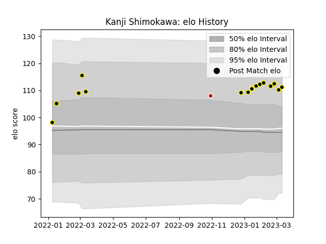

---  
layout: page  
title: Kanji Shimokawa  
date: 2023-01-13 11:39:15.010651  
categories: player  
---
# Kanji Shimokawa

## Positions: FL

## Current elo: 107.0

## Current Percentile: 76.0

# Elo History

# Match History

| Team             |   Appearances |   Win Rate |
|:-----------------|--------------:|-----------:|
| Tokyo Sungoliath |             7 |   0.857143 |

| Opponent                          |   Matches |   Win Rate |
|:----------------------------------|----------:|-----------:|
| Green Rockets Tokatsu             |         1 |          1 |
| Kobelco Kobe Steelers             |         1 |          1 |
| Kubota Spears Funabashi Tokyo-Bay |         1 |          1 |
| Saitama Wild Knights              |         1 |          0 |
| Toshiba Brave Lupus Tokyo         |         1 |          1 |
| Toyota Verblitz                   |         1 |          1 |
| Yokohama Canon Eagles             |         1 |          1 |