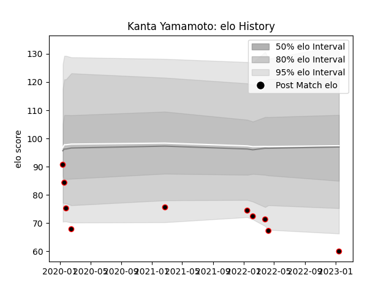

---  
layout: page  
title: Kanta Yamamoto  
date: 2023-02-02 19:12:32.427498  
categories: player  
---
# Kanta Yamamoto

## Positions: FB, W

## Current elo: 55.0

## Current Percentile: 2.0

# Elo History

# Match History

| Team                            |   Appearances |   Win Rate |
|:--------------------------------|--------------:|-----------:|
| NTT Docomo Red Hurricanes Osaka |            11 |   0.272727 |

| Opponent                          |   Matches |   Win Rate |
|:----------------------------------|----------:|-----------:|
| Tokyo Sungoliath                  |         2 |          0 |
| Toshiba Brave Lupus Tokyo         |         2 |          0 |
| Kubota Spears Funabashi Tokyo-Bay |         1 |          0 |
| Kurita Water Gush                 |         1 |          0 |
| Mitsubishi Dynaboars              |         1 |          1 |
| Munakata Sanix Blues              |         1 |          0 |
| Shizuoka Blue Revs                |         1 |          0 |
| Skyactivs Hiroshima               |         1 |          1 |
| Yokohama Canon Eagles             |         1 |          1 |