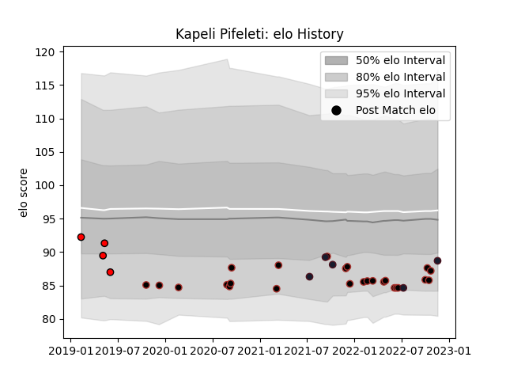

---  
layout: page  
title: Kapeli Pifeleti  
date: 2022-11-22 11:39:28.379737  
categories: player  
---
# Kapeli Pifeleti

## Positions: H

## Country: United States of America

## Current elo: 89.0

## Current Percentile: 16.0

# Elo History

# Match History

| Team                     |   Appearances |   Win Rate |
|:-------------------------|--------------:|-----------:|
| Saracens                 |            25 |       0.56 |
| United States of America |             5 |       0.5  |
| San Diego Legion         |             4 |       0.75 |

| Opponent           |   Matches |   Win Rate |
|:-------------------|----------:|-----------:|
| Exeter Chiefs      |         4 |       0.75 |
| Bath Rugby         |         2 |       1    |
| Gloucester Rugby   |         2 |       0.5  |
| Wasps              |         2 |       0    |
| Sale Sharks        |         2 |       0.5  |
| Newcastle Falcons  |         2 |       1    |
| NOLA Gold          |         2 |       1    |
| Leicester Tigers   |         2 |       0.5  |
| Harlequins         |         1 |       1    |
| Houston SaberCats  |         1 |       1    |
| Ireland            |         1 |       0    |
| Jersey             |         1 |       1    |
| Bristol Rugby      |         1 |       1    |
| London Irish       |         1 |       0    |
| Munster            |         1 |       0    |
| Edinburgh          |         1 |       0    |
| Cornish Pirates    |         1 |       0    |
| Northampton Saints |         1 |       0    |
| Portugal           |         1 |       0.5  |
| Chile              |         1 |       1    |
| Toronto Arrows     |         1 |       0    |
| Uruguay            |         1 |       0    |
| Canada             |         1 |       1    |
| Worcester Warriors |         1 |       1    |