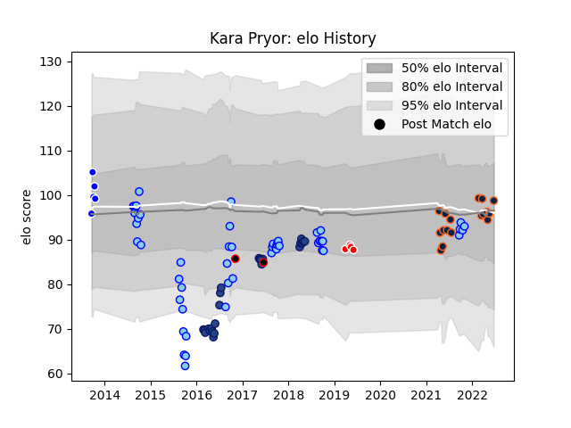

---  
layout: page  
title: Kara Pryor  
date: 2023-03-21 18:37:53.445131  
categories: player  
---
# Kara Pryor

Last updated: 2023-03-21
## Positions: FL, N8

## Country: New Zealand Maori

## Current elo: 99.0

## Current Percentile: 52.0

# Elo History

# Match History

| Team              |   Appearances |   Win Rate |
|:------------------|--------------:|-----------:|
| Northland         |            51 |   0.27451  |
| Blues             |            24 |   0.479167 |
| R.U. New York     |            18 |   0.611111 |
| Rugby New York    |            17 |   0.705882 |
| Auckland          |             5 |   0.4      |
| Sunwolves         |             4 |   0.25     |
| New Zealand Maori |             2 |   0.5      |

| Opponent                 |   Matches |   Win Rate |
|:-------------------------|----------:|-----------:|
| Otago                    |         7 |   0.285714 |
| Wellington               |         6 |   0.166667 |
| NOLA Gold                |         6 |   0.5      |
| Manawatu                 |         6 |   0.166667 |
| Southland                |         6 |   0.333333 |
| Hawke's Bay              |         5 |   0.4      |
| Toronto Arrows           |         5 |   0.2      |
| North Harbour            |         4 |   0.25     |
| New England Free Jacks   |         4 |   0.25     |
| Rugby ATL                |         4 |   1        |
| Auckland                 |         4 |   0        |
| Bay of Plenty            |         4 |   0.5      |
| Houston SaberCats        |         3 |   1        |
| Counties Manukau         |         3 |   0.333333 |
| L. A. Giltinis           |         3 |   0.666667 |
| Chiefs                   |         3 |   0.166667 |
| Waikato                  |         3 |   0.666667 |
| Canterbury               |         3 |   0.333333 |
| Brumbies                 |         3 |   0.333333 |
| Seattle Seawolves        |         3 |   1        |
| San Diego Legion         |         3 |   1        |
| Old Glory DC             |         3 |   1        |
| Hurricanes               |         3 |   0        |
| Tasman                   |         2 |   0        |
| Taranaki                 |         2 |   0        |
| Sharks                   |         2 |   0.5      |
| New South Wales Waratahs |         2 |   1        |
| Queensland Reds          |         2 |   0.5      |
| Highlanders              |         2 |   0.5      |
| Crusaders                |         2 |   0        |
| British and Irish Lions  |         2 |   0.5      |
| Northland                |         1 |   1        |
| Austin Gilgronis         |         1 |   0        |
| Melbourne Rebels         |         1 |   1        |
| Southern Kings           |         1 |   1        |
| Lions                    |         1 |   0        |
| Stormers                 |         1 |   0        |
| Sunwolves                |         1 |   1        |
| Jaguares                 |         1 |   0        |
| United States of America |         1 |   1        |
| Cheetahs                 |         1 |   1        |
| Western Force            |         1 |   1        |