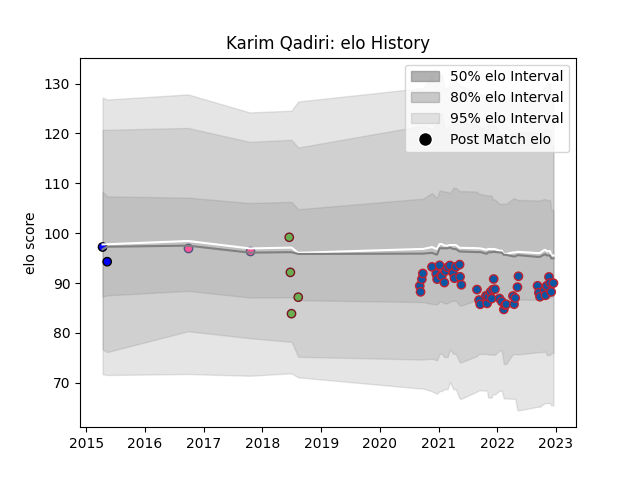

---  
layout: page  
title: Karim Qadiri  
date: 2022-12-12 15:39:53.941741  
categories: player  
---
# Karim Qadiri

## Positions: W

## Country: Morocco

## Current elo: 88.0

## Current Percentile: 26.0

# Elo History

# Match History

| Team                 |   Appearances |   Win Rate |
|:---------------------|--------------:|-----------:|
| Grenoble             |            45 |   0.522222 |
| Morocco              |             4 |   0.125    |
| Stade Francais Paris |             2 |   0        |
| Massy                |             1 |   0        |

| Opponent                   |   Matches |   Win Rate |
|:---------------------------|----------:|-----------:|
| Montauban                  |         6 |   0.5      |
| Aurillac                   |         4 |   0.5      |
| Oyonnax                    |         4 |   0.5      |
| Nevers                     |         4 |   0.875    |
| Biarritz Olympique         |         3 |   0.166667 |
| Carcassonne                |         3 |   0.666667 |
| Soyaux-Angouleme           |         3 |   0.666667 |
| Provence Rugby             |         3 |   0.333333 |
| Agen                       |         2 |   0.5      |
| US Bressane                |         2 |   0.5      |
| Rouen                      |         2 |   1        |
| Narbonne                   |         2 |   0.75     |
| Mont-de-Marsan             |         2 |   0.5      |
| Colomiers                  |         2 |   0        |
| Beziers                    |         2 |   0        |
| Namibia                    |         1 |   0        |
| Krasny Yar                 |         1 |   0        |
| Kenya                      |         1 |   0        |
| Stade Toulousain           |         1 |   0        |
| Uganda                     |         1 |   0        |
| Valence Romans Drome Rugby |         1 |   1        |
| Vannes                     |         1 |   0        |
| Zimbabwe                   |         1 |   0.5      |