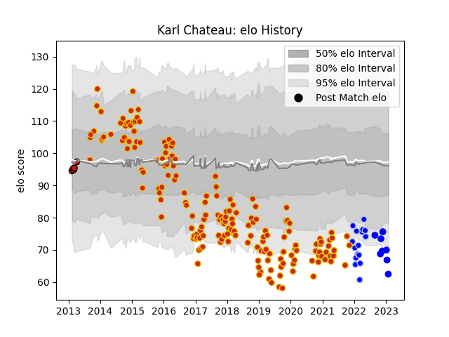

---  
layout: page  
title: Karl Chateau  
date: 2023-03-21 18:14:27.751123  
categories: player  
---
# Karl Chateau

Last updated: 2023-03-21
## Positions: FL, N8

## Current elo: 75.0

## Current Percentile: 5.0

# Elo History

# Match History

| Team             |   Appearances |   Win Rate |
|:-----------------|--------------:|-----------:|
| Perpignan        |           182 |   0.527473 |
| Colomiers        |            17 |   0.529412 |
| Stade Toulousain |             5 |   0.4      |
| Vannes           |             5 |   0.5      |

| Opponent                   |   Matches |   Win Rate |
|:---------------------------|----------:|-----------:|
| Montauban                  |        14 |   0.535714 |
| Mont-de-Marsan             |        12 |   0.416667 |
| Aurillac                   |        11 |   0.545455 |
| Beziers                    |        11 |   0.636364 |
| Grenoble                   |        10 |   0.8      |
| Agen                       |        10 |   0.45     |
| Biarritz Olympique         |        10 |   0.6      |
| Narbonne                   |         9 |   0.777778 |
| Carcassonne                |         9 |   0.666667 |
| Colomiers                  |         9 |   0.388889 |
| Dax                        |         6 |   0.333333 |
| Soyaux-Angouleme           |         6 |   0.833333 |
| Nevers                     |         6 |   0.833333 |
| Vannes                     |         6 |   1        |
| Rouen                      |         5 |   0.6      |
| Racing 92                  |         5 |   0.1      |
| Provence Rugby             |         5 |   0.4      |
| Albi                       |         5 |   0.6      |
| Bayonne                    |         5 |   0.8      |
| Oyonnax                    |         5 |   0.4      |
| Bordeaux Begles            |         4 |   0.375    |
| Clermont Auvergne          |         4 |   0        |
| Pau                        |         4 |   0.25     |
| Bourgoin-Jallieu           |         4 |   0.75     |
| Lyon                       |         4 |   0.25     |
| Montpellier Herault        |         3 |   0.666667 |
| Massy                      |         3 |   0.666667 |
| Tarbes                     |         3 |   0.666667 |
| Toulon                     |         3 |   0        |
| Stade Toulousain           |         3 |   0        |
| Castres Olympique          |         2 |   0        |
| US Bressane                |         2 |   0.5      |
| Stade Francais Paris       |         2 |   0        |
| Edinburgh                  |         2 |   0.5      |
| Sale Sharks                |         1 |   0        |
| Roval Drome XV             |         1 |   1        |
| Gloucester Rugby           |         1 |   0        |
| La Rochelle                |         1 |   0        |
| Connacht                   |         1 |   0        |
| Valence Romans Drome Rugby |         1 |   1        |
| Perpignan                  |         1 |   0        |