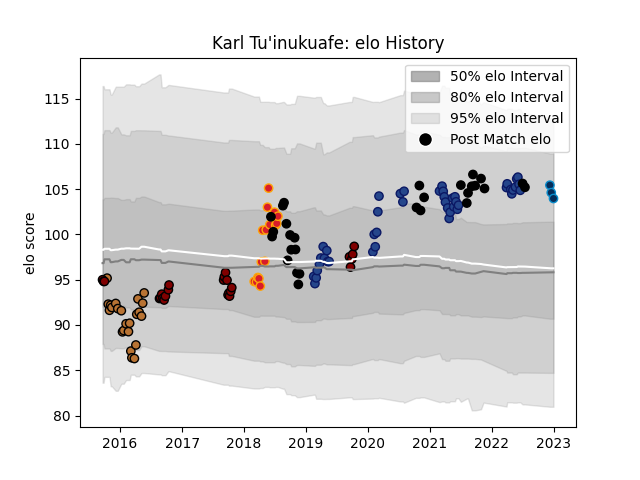

---  
layout: page  
title: Karl Tu'inukuafe  
date: 2022-12-31 16:29:05.978439  
categories: player  
---
# Karl Tu'inukuafe

## Positions: P

## Country: New Zealand

## Current elo: 104.0

## Current Percentile: None

# Elo History

# Match History

| Team                |   Appearances |   Win Rate |
|:--------------------|--------------:|-----------:|
| Blues               |            44 |   0.659091 |
| New Zealand         |            28 |   0.803571 |
| North Harbour       |            25 |   0.5      |
| Narbonne            |            23 |   0.434783 |
| Chiefs              |            16 |   0.6875   |
| Montpellier Herault |             3 |   0.333333 |

| Opponent                 |   Matches |   Win Rate |
|:-------------------------|----------:|-----------:|
| Australia                |        10 |   0.85     |
| Highlanders              |         9 |   0.777778 |
| Hurricanes               |         7 |   0.571429 |
| Crusaders                |         7 |   0        |
| Chiefs                   |         6 |   0.5      |
| Brumbies                 |         5 |   0.8      |
| Canterbury               |         4 |   0        |
| Argentina                |         4 |   1        |
| Ireland                  |         4 |   0.25     |
| New South Wales Waratahs |         4 |   1        |
| Otago                    |         3 |   0        |
| France                   |         3 |   1        |
| Manawatu                 |         3 |   0.666667 |
| South Africa             |         3 |   0.666667 |
| Stormers                 |         3 |   1        |
| Tasman                   |         3 |   0.166667 |
| Perpignan                |         2 |   0.5      |
| Lyon                     |         2 |   0.5      |
| Queensland Reds          |         2 |   1        |
| Northland                |         2 |   1        |
| Sharks                   |         2 |   0        |
| Montauban                |         2 |   0.5      |
| Mont-de-Marsan           |         2 |   0.5      |
| Moana Pasifika           |         2 |   1        |
| Melbourne Rebels         |         2 |   1        |
| Sunwolves                |         2 |   1        |
| Waikato                  |         2 |   0.5      |
| Wellington               |         2 |   0.5      |
| Albi                     |         2 |   0.5      |
| Western Force            |         2 |   1        |
| Biarritz Olympique       |         2 |   0        |
| Aurillac                 |         2 |   0.5      |
| Dax                      |         2 |   0.5      |
| Counties Manukau         |         2 |   1        |
| Carcassonne              |         2 |   0.5      |
| Bulls                    |         2 |   1        |
| Jaguares                 |         2 |   0        |
| Blues                    |         2 |   1        |
| London Irish             |         1 |   1        |
| Auckland                 |         1 |   1        |
| Wales                    |         1 |   1        |
| Tonga                    |         1 |   1        |
| Bayonne                  |         1 |   0        |
| Taranaki                 |         1 |   1        |
| Beziers                  |         1 |   1        |
| Bourgoin-Jallieu         |         1 |   0        |
| Southland                |         1 |   1        |
| Bordeaux Begles          |         1 |   0        |
| Provence Rugby           |         1 |   0        |
| Ospreys                  |         1 |   0        |
| Colomiers                |         1 |   1        |
| England                  |         1 |   1        |
| Fijian Drua              |         1 |   1        |
| Hawke's Bay              |         1 |   1        |
| Italy                    |         1 |   1        |