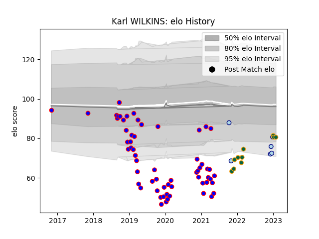

---  
layout: page  
title: Karl WILKINS  
date: 2023-01-06 11:50:58.120803  
categories: player  
---
# Karl WILKINS

## Positions: FL

## Current elo: 81.0

## Current Percentile: 13.0

# Elo History

# Match History

| Team               |   Appearances |   Win Rate |
|:-------------------|--------------:|-----------:|
| Beziers            |            61 |   0.47541  |
| Northampton Saints |             8 |   0.5      |
| Bedford            |             6 |   0.666667 |

| Opponent            |   Matches |   Win Rate |
|:--------------------|----------:|-----------:|
| Mont-de-Marsan      |         6 |   0.333333 |
| Carcassonne         |         5 |   0.6      |
| Vannes              |         4 |   0.25     |
| Biarritz Olympique  |         4 |   0.5      |
| Rouen               |         4 |   0.5      |
| Colomiers           |         4 |   0.5      |
| Provence Rugby      |         4 |   0.75     |
| Nevers              |         4 |   0.25     |
| Montauban           |         4 |   1        |
| Aurillac            |         4 |   0.25     |
| Soyaux-Angouleme    |         3 |   0.333333 |
| Perpignan           |         3 |   0.333333 |
| Oyonnax             |         3 |   0.333333 |
| Massy               |         2 |   1        |
| US Bressane         |         2 |   0.5      |
| Sale Sharks         |         2 |   0        |
| Ampthill            |         2 |   1        |
| Brive               |         2 |   0.5      |
| Jersey              |         1 |   0        |
| Hartpury College    |         1 |   1        |
| Harlequins          |         1 |   1        |
| Newcastle Falcons   |         1 |   1        |
| Nottingham          |         1 |   1        |
| Grenoble            |         1 |   0        |
| Gloucester Rugby    |         1 |   0        |
| Ealing Trailfinders |         1 |   0        |
| Roval Drome XV      |         1 |   1        |
| Bristol Rugby       |         1 |   1        |
| Bayonne             |         1 |   0        |
| Bath Rugby          |         1 |   1        |
| Leicester Tigers    |         1 |   0        |