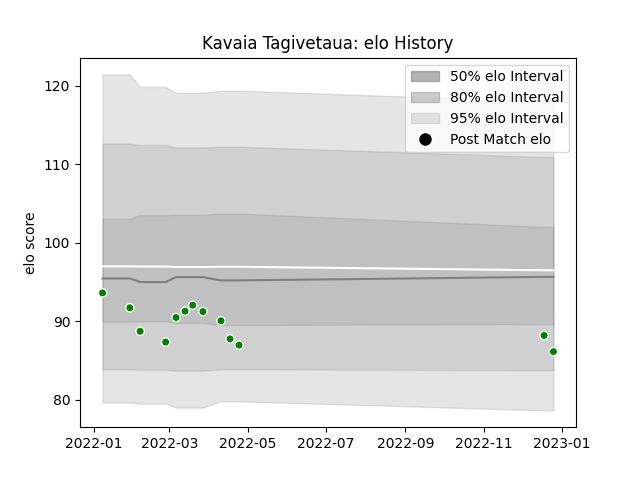

---  
layout: page  
title: Kavaia Tagivetaua  
date: 2022-12-28 12:54:35.618168  
categories: player  
---
# Kavaia Tagivetaua

## Positions: FL

## Current elo: 86.0

## Current Percentile: 16.0

# Elo History

# Match History

| Team                  |   Appearances |   Win Rate |
|:----------------------|--------------:|-----------:|
| Green Rockets Tokatsu |            13 |  0.0769231 |

| Opponent                          |   Matches |   Win Rate |
|:----------------------------------|----------:|-----------:|
| Kobelco Kobe Steelers             |         2 |          0 |
| Kubota Spears Funabashi Tokyo-Bay |         2 |          0 |
| Black Rams Tokyo                  |         1 |          0 |
| Hanazono Kintetsu Liners          |         1 |          1 |
| NTT Docomo Red Hurricanes Osaka   |         1 |          0 |
| Shizuoka Blue Revs                |         1 |          0 |
| Tokyo Sungoliath                  |         1 |          0 |
| Toshiba Brave Lupus Tokyo         |         1 |          0 |
| Toyota Verblitz                   |         1 |          0 |
| Urayasu D-Rocks                   |         1 |          0 |
| Yokohama Canon Eagles             |         1 |          0 |