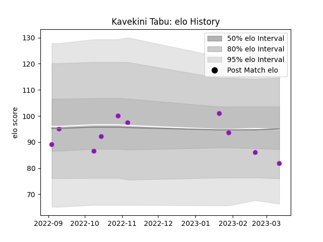

---  
layout: page  
title: Kavekini Tabu  
date: 2023-03-17 17:38:28.478909  
categories: player  
---
# Kavekini Tabu

## Positions: W

## Current elo: 82.0

## Current Percentile: 21.0

# Elo History

# Match History

| Team        |   Appearances |   Win Rate |
|:------------|--------------:|-----------:|
| US Bressane |            10 |        0.6 |

| Opponent                   |   Matches |   Win Rate |
|:---------------------------|----------:|-----------:|
| Carqueiranne-Hyères        |         2 |        0.5 |
| Nice                       |         2 |        0.5 |
| Blagnac                    |         1 |        0   |
| Bourgoin-Jallieu           |         1 |        1   |
| Chambery                   |         1 |        1   |
| Cognac Saint Jean d'Angély |         1 |        1   |
| Dax                        |         1 |        0   |
| Rennes                     |         1 |        1   |