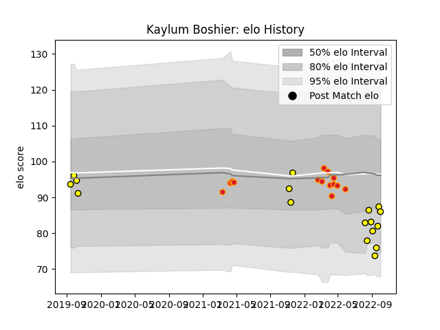

---  
layout: page  
title: Kaylum Boshier  
date: 2023-03-21 18:53:25.332200  
categories: player  
---
# Kaylum Boshier

Last updated: 2023-03-21
## Positions: FL, N8

## Current elo: 86.0

## Current Percentile: 28.0

# Elo History

# Match History

| Team     |   Appearances |   Win Rate |
|:---------|--------------:|-----------:|
| Taranaki |            17 |   0.411765 |
| Chiefs   |            14 |   0.714286 |

| Opponent         |   Matches |   Win Rate |
|:-----------------|----------:|-----------:|
| Crusaders        |         4 |        0.5 |
| Southland        |         3 |        1   |
| Auckland         |         2 |        0   |
| Blues            |         2 |        0   |
| Waikato          |         2 |        0   |
| Highlanders      |         2 |        1   |
| Hurricanes       |         2 |        1   |
| Bay of Plenty    |         2 |        0   |
| Moana Pasifika   |         2 |        1   |
| Otago            |         1 |        1   |
| Tasman           |         1 |        0   |
| Queensland Reds  |         1 |        1   |
| Manawatu         |         1 |        1   |
| Northland        |         1 |        0   |
| North Harbour    |         1 |        0   |
| Fijian Drua      |         1 |        1   |
| Counties Manukau |         1 |        1   |
| Canterbury       |         1 |        1   |
| Wellington       |         1 |        0   |