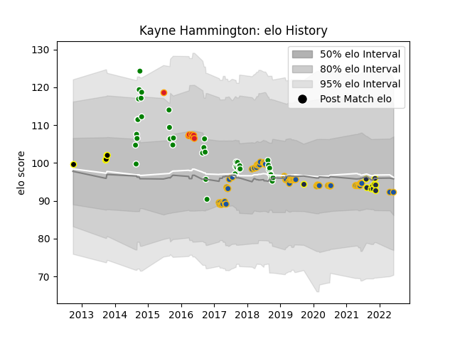

---  
layout: page  
title: Kayne Hammington  
date: 2022-12-28 12:58:36.050023  
categories: player  
---
# Kayne Hammington

## Positions: SH

## Current elo: 99.0

## Current Percentile: None

# Elo History

# Match History

| Team                |   Appearances |   Win Rate |
|:--------------------|--------------:|-----------:|
| Highlanders         |            65 |   0.523077 |
| Manawatu            |            40 |   0.425    |
| Otago               |             9 |   0.444444 |
| Chiefs              |             7 |   0.571429 |
| Wellington          |             4 |   0.75     |
| Shimizu Blue Sharks |             1 |   0        |

| Opponent                 |   Matches |   Win Rate |
|:-------------------------|----------:|-----------:|
| Blues                    |         9 |   0.666667 |
| Crusaders                |         9 |   0.111111 |
| Hawke's Bay              |         7 |   0.285714 |
| Waikato                  |         6 |   0.666667 |
| Southland                |         6 |   1        |
| Hurricanes               |         6 |   0        |
| Melbourne Rebels         |         6 |   0.666667 |
| Chiefs                   |         6 |   0.416667 |
| Brumbies                 |         6 |   0.833333 |
| New South Wales Waratahs |         6 |   0.5      |
| Canterbury               |         5 |   0.6      |
| Taranaki                 |         5 |   0        |
| Bulls                    |         4 |   0.625    |
| Queensland Reds          |         4 |   1        |
| Wellington               |         4 |   0.25     |
| Northland                |         3 |   0.666667 |
| Sharks                   |         3 |   0.333333 |
| Western Force            |         3 |   1        |
| Bay of Plenty            |         3 |   0.666667 |
| Tasman                   |         3 |   0.333333 |
| Otago                    |         3 |   0        |
| Stormers                 |         2 |   0.5      |
| Auckland                 |         2 |   0.5      |
| North Harbour            |         2 |   0        |
| Lions                    |         2 |   0.5      |
| Highlanders              |         2 |   0        |
| Counties Manukau         |         2 |   0.5      |
| Manawatu                 |         2 |   0.5      |
| Jaguares                 |         1 |   1        |
| Sunwolves                |         1 |   1        |
| Urayasu D-Rocks          |         1 |   0        |
| Cheetahs                 |         1 |   1        |
| British and Irish Lions  |         1 |   1        |