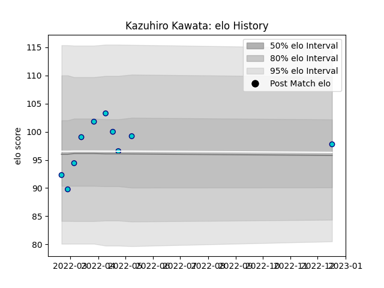

---  
layout: page  
title: Kazuhiro Kawata  
date: 2023-03-17 16:59:42.746535  
categories: player  
---
# Kazuhiro Kawata

## Positions: P

## Current elo: 99.0

## Current Percentile: 80.0

# Elo History

# Match History

| Team               |   Appearances |   Win Rate |
|:-------------------|--------------:|-----------:|
| Shizuoka Blue Revs |            22 |   0.318182 |

| Opponent                          |   Matches |   Win Rate |
|:----------------------------------|----------:|-----------:|
| Toshiba Brave Lupus Tokyo         |         3 |       0    |
| Black Rams Tokyo                  |         2 |       0.5  |
| Green Rockets Tokatsu             |         2 |       1    |
| Kubota Spears Funabashi Tokyo-Bay |         2 |       0    |
| Saitama Wild Knights              |         2 |       0    |
| Tokyo Sungoliath                  |         2 |       0    |
| Toyota Verblitz                   |         2 |       0    |
| Yokohama Canon Eagles             |         2 |       0.25 |
| Hanazono Kintetsu Liners          |         1 |       1    |
| Kobelco Kobe Steelers             |         1 |       0    |
| Mitsubishi Dynaboars              |         1 |       0.5  |
| NTT Docomo Red Hurricanes Osaka   |         1 |       1    |
| Urayasu D-Rocks                   |         1 |       1    |