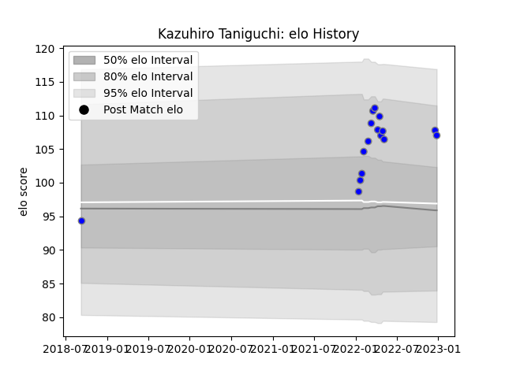

---  
layout: page  
title: Kazuhiro Taniguchi  
date: 2023-02-02 19:00:13.194727  
categories: player  
---
# Kazuhiro Taniguchi

## Positions: SH

## Current elo: 118.0

## Current Percentile: 94.0

# Elo History

# Match History

| Team                              |   Appearances |   Win Rate |
|:----------------------------------|--------------:|-----------:|
| Kubota Spears Funabashi Tokyo-Bay |            20 |      0.725 |

| Opponent                        |   Matches |   Win Rate |
|:--------------------------------|----------:|-----------:|
| Green Rockets Tokatsu           |         3 |   1        |
| Kobelco Kobe Steelers           |         3 |   0.666667 |
| Yokohama Canon Eagles           |         3 |   0.5      |
| Tokyo Sungoliath                |         2 |   0.5      |
| Urayasu D-Rocks                 |         2 |   1        |
| Black Rams Tokyo                |         1 |   1        |
| Hanazono Kintetsu Liners        |         1 |   1        |
| NTT Docomo Red Hurricanes Osaka |         1 |   1        |
| Saitama Wild Knights            |         1 |   0        |
| Shizuoka Blue Revs              |         1 |   0        |
| Toshiba Brave Lupus Tokyo       |         1 |   1        |
| Toyota Verblitz                 |         1 |   1        |