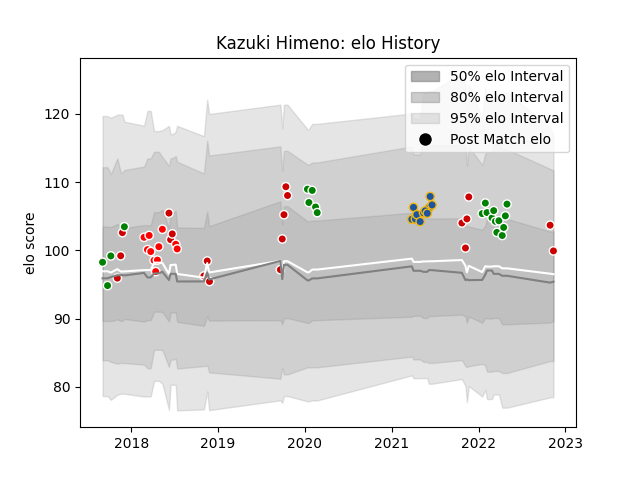

---  
layout: page  
title: Kazuki Himeno  
date: 2023-01-13 11:29:13.047841  
categories: player  
---
# Kazuki Himeno

## Positions: N8, FL

## Country: Japan

## Current elo: 104.0

## Current Percentile: 68.0

# Elo History

# Match History

| Team            |   Appearances |   Win Rate |
|:----------------|--------------:|-----------:|
| Toyota Verblitz |            26 |  0.576923  |
| Japan           |            22 |  0.431818  |
| Highlanders     |            11 |  0.636364  |
| Sunwolves       |            11 |  0.0909091 |

| Opponent                          |   Matches |   Win Rate |
|:----------------------------------|----------:|-----------:|
| Black Rams Tokyo                  |         4 |   0.75     |
| Blues                             |         3 |   0.333333 |
| Shizuoka Blue Revs                |         3 |   0.666667 |
| Saitama Wild Knights              |         3 |   0        |
| Queensland Reds                   |         3 |   0.666667 |
| New South Wales Waratahs          |         3 |   0.333333 |
| Hurricanes                        |         3 |   0        |
| Australia                         |         2 |   0        |
| Italy                             |         2 |   0.5      |
| Toshiba Brave Lupus Tokyo         |         2 |   0.5      |
| Tokyo Sungoliath                  |         2 |   0        |
| Scotland                          |         2 |   0.5      |
| Russia                            |         2 |   1        |
| New Zealand                       |         2 |   0        |
| Kubota Spears Funabashi Tokyo-Bay |         2 |   0.5      |
| Yokohama Canon Eagles             |         2 |   0.5      |
| Ireland                           |         2 |   0.5      |
| Brumbies                          |         2 |   0.5      |
| France                            |         2 |   0.25     |
| England                           |         2 |   0        |
| Crusaders                         |         2 |   0.5      |
| Chiefs                            |         2 |   0        |
| Sharks                            |         1 |   0        |
| Western Force                     |         1 |   1        |
| Urayasu D-Rocks                   |         1 |   1        |
| Toyota Industries Shuttles Aichi  |         1 |   1        |
| British and Irish Lions           |         1 |   0        |
| Tonga                             |         1 |   1        |
| South Africa                      |         1 |   0        |
| Samoa                             |         1 |   1        |
| Coca-Cola Red Sparks              |         1 |   1        |
| Lions                             |         1 |   0        |
| Portugal                          |         1 |   1        |
| Georgia                           |         1 |   1        |
| Green Rockets Tokatsu             |         1 |   1        |
| NTT Docomo Red Hurricanes Osaka   |         1 |   1        |
| Hino Red Dolphins                 |         1 |   1        |
| Mie Honda Heat                    |         1 |   1        |
| Melbourne Rebels                  |         1 |   1        |
| Mitsubishi Dynaboars              |         1 |   0        |