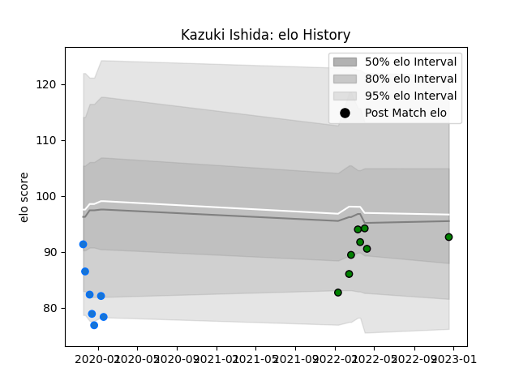

---  
layout: page  
title: Kazuki Ishida  
date: 2023-03-21 18:38:12.303108  
categories: player  
---
# Kazuki Ishida

Last updated: 2023-03-21
## Positions: FH, FB

## Current elo: 91.0

## Current Percentile: 44.0

# Elo History

# Match History

| Team                 |   Appearances |   Win Rate |
|:---------------------|--------------:|-----------:|
| Mitsubishi Dynaboars |            20 |      0.625 |
| Shimizu Blue Sharks  |             7 |      0     |

| Opponent                          |   Matches |   Win Rate |
|:----------------------------------|----------:|-----------:|
| Hanazono Kintetsu Liners          |         3 |   0.666667 |
| Saitama Wild Knights              |         2 |   0        |
| Hino Red Dolphins                 |         2 |   1        |
| Kamaishi Seawaves                 |         2 |   0.5      |
| Skyactivs Hiroshima               |         2 |   1        |
| Coca-Cola Red Sparks              |         2 |   0.5      |
| Mie Honda Heat                    |         2 |   0.5      |
| Black Rams Tokyo                  |         1 |   1        |
| Toyota Industries Shuttles Aichi  |         1 |   0        |
| Toshiba Brave Lupus Tokyo         |         1 |   1        |
| Tokyo Sungoliath                  |         1 |   0        |
| Shizuoka Blue Revs                |         1 |   0.5      |
| Kyuden Voltex                     |         1 |   0        |
| Mazda Blue Zoomers                |         1 |   0        |
| Kurita Water Gush                 |         1 |   0        |
| Kubota Spears Funabashi Tokyo-Bay |         1 |   0        |
| Kobelco Kobe Steelers             |         1 |   0        |
| Green Rockets Tokatsu             |         1 |   0        |
| Toyota Verblitz                   |         1 |   1        |