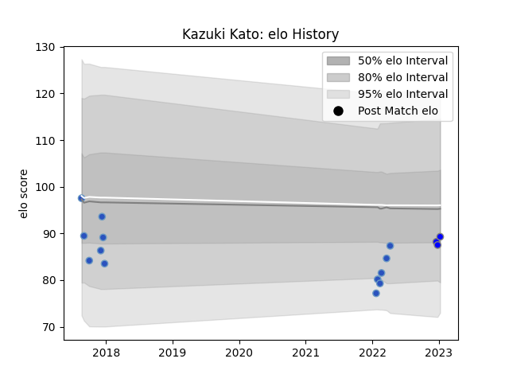

---  
layout: page  
title: Kazuki Kato  
date: 2023-01-13 11:38:00.029768  
categories: player  
---
# Kazuki Kato

## Positions: L, P

## Current elo: 89.0

## Current Percentile: 23.0

# Elo History

# Match History

| Team                              |   Appearances |   Win Rate |
|:----------------------------------|--------------:|-----------:|
| Munakata Sanix Blues              |            13 |   0.461538 |
| Kubota Spears Funabashi Tokyo-Bay |             3 |   0.833333 |

| Opponent                          |   Matches |   Win Rate |
|:----------------------------------|----------:|-----------:|
| Chugoku Red Regulions             |         2 |        1   |
| Hanazono Kintetsu Liners          |         2 |        0.5 |
| Kyuden Voltex                     |         2 |        1   |
| Black Rams Tokyo                  |         1 |        0   |
| Coca-Cola Red Sparks              |         1 |        1   |
| Kubota Spears Funabashi Tokyo-Bay |         1 |        0   |
| Kurita Water Gush                 |         1 |        1   |
| Saitama Wild Knights              |         1 |        0   |
| Shimizu Blue Sharks               |         1 |        0   |
| Shizuoka Blue Revs                |         1 |        0   |
| Tokyo Sungoliath                  |         1 |        1   |
| Toyota Industries Shuttles Aichi  |         1 |        0   |
| Yokohama Canon Eagles             |         1 |        0.5 |